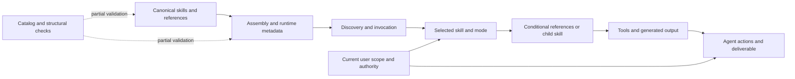

# Audit of the skill instruction system

Date: 2026-09-05. Scope: the complete Rahulskills worktree, including ignored generated and stale trees. Sections 1–14 record the original inspect-only audit and its unchanged-source checkpoint. [Section 15](#15-follow-up-after-the-users-review) records subsequent direction and the explicitly requested retirement cleanup. See [OPTIMIZATION_PLAN.md](OPTIMIZATION_PLAN.md) for revised classified actions and verification cases.

The corpus already has valuable specialization and shared infrastructure. Its largest reliability problems are **conflicting instructions across entrypoints, examples, metadata, and generated reports**, followed by workflows that exceed the scope suggested by their triggers. Broad mergers would make those problems worse. Repair concrete contradictions first, then separate expensive modes while preserving salient reminders.

## 1. Corpus architecture

### Scope and evidence

The recursive census found **617 files outside Git internals**, including **202 `SKILL.md` copies**: 50 canonical source entrypoints, 99 assembled runtime entrypoints, and 53 stale archived entrypoints. Canonical skill directories contain 129 non-cache files: 50 entrypoints and 79 supporting files. All 50 entrypoints and their source/support files were covered by the parent and three bounded cluster reviewers. Text references, templates, scripts, metadata, overlays, the capability catalog, and packaging/discovery logic were inspected as parts of the instruction system.

Generated copies were compared against source, with historical-only definitions inspected separately. Related architectural documents and diagram previews were reviewed as context; identical generated diagram payloads were compared and deduplicated for reading. Binary caches, local databases, image/license assets, and Git object/backup internals are not active instruction authorities. They were classified rather than executed or mined for unrelated private contents. Nothing outside the requested corpus was installed, refreshed, or activated. The available memory query was bound to another project and returned unrelated zero-relevance results; those were discarded rather than imported as corpus evidence.

At entrypoint level the source contains **8,997 lines and 375,666 characters**, approximately **93,919 tokens** using characters/4. This is a comparison estimate, not an Astra tokenizer measurement and not the cost of one invocation. Names/descriptions are the discovery surface; descriptions alone are about 3,574 estimated tokens. Supporting assets, license text, executable code, and dormant references do not automatically enter an agent's prompt.

| Surface | Role in actual behavior | Architectural implication |
|---|---|---|
| `skills/<name>/SKILL.md` | Discovery trigger plus task policy/workflow | Canonical authoring surface; route by intended outcome before loading detail. |
| `agents/openai.yaml` and `overlays/` | UI prompts, defaults, dependencies and runtime tool affordances | They can change the invoked task even when the body is unchanged; audit as instructions, not decoration. |
| Skill-local references/templates/scripts | Conditional knowledge, executable examples, generated agent advice | Output from a script can contradict its entrypoint and must be reviewed as a behavioral surface. |
| `references/` | Five shared gptengage/history contracts | Useful existing composition; do not replace with a universal governance layer. |
| `capabilities/skills.toml` | 55 catalog entries: 50 package skills plus five additional runtime-owned names | Useful metadata, but effect/layer/overlap labels are incomplete descriptions rather than enforced permission contracts. Six runtime exclusions include the package's `skill-creator`. |
| `stitch-skills.sh`, sync/install scripts | Assemble runtime variants and preserve backups | Source, assembled, installed, and archived are different provenance states. Installation is an external-state action. |
| `docs/`, `agent_reports/`, root handoff | Prior design proposals, review evidence and session state | Helpful context; no automatic authority to implement prior proposals or resume a handoff. |

The operational pattern is a collection of focused workflows with several composers, not one mandatory pipeline. Product framing, an operating charter, a dependency plan, an execution loop, and a MetaBuilder harness answer different questions. A task may need only one. The older [composition audit](docs/skill-composition-audit.md), especially lines 159–191 and 252–269, proposes a larger callable-skill interface and runtime machinery; it is explicitly a proposal and is not the minimum repair justified here.

### Verification performed

- `PYTHONDONTWRITEBYTECODE=1 ./audit-skills.sh check`: passed; 50 manifests, 55 catalog entries, congruent source/README inventory, and links across 86 maintained Markdown files.
- `python3 -B scripts/audit_catalog.py --root skills --strict --json`: passed; 50 unique source definitions, no divergent source-name collisions, two entries above its 400-line heuristic.
- Executed only the vocabulary skill's jq validator against a synthetic valid response: exit **5**, `Cannot index array with string "verdict"`. No LLM, proposal, or merge was run.
- Historical-rewrite behavior was corroborated by read-only inspection of the already installed filter-repo implementation; no Git rewrite was executed.
- Source hashes were captured before inspection for final no-modification verification. Report links and cited line bounds are checked separately because the package checker intentionally omits new root-level reports.

Structural checks do not prove semantic reliability. Most findings below are direct textual contradictions or static implementation evidence. Predicted task-completion and token improvements remain hypotheses to evaluate with the bounded cases in the plan; no Astra-versus-other-model performance claim is made.

## 2. Semantic clusters

Each source skill has one primary cluster here; cross-cluster relationships appear in the matrix. These are analytical groupings, not proposed new directories or required routers.

| Cluster | Members | Boundary that matters |
|---|---|---|
| Product direction and governance | frame-goals-constraints, define-operating-charter, objective-to-dag-decomposition | Product meaning, standing authority, and execution dependencies are different artifacts. |
| Autonomous execution and governed harnesses | autonomous-execution-contract, autonomy-loop, metabuilder, metabuilder-harness-design, metabuilder-consumer-qualification | Bounded execution, repeated selection, harness design, admission, and consumer judgment remain distinct. |
| Inquiry and external model operations | grilling, grill-me, invokellm, debate, ideate, ecosystem-borrow-audit | Interactive questions, speculative research, model consultation, and evidence-only auditing have different actors and cost profiles. |
| Git, delivery and repository policy | commit, squash-commits, rewrite-commit-messages, reference-cleaner, pr-lifecycle, handoff, git-status-report, install-commithooks, privateify, repo-topics | New commits, rewrites, observations, repository policy, and remote mutation require different scope and verification. |
| Code, tests and documentation | clean-code-refine, fp-refine, pythonpackagesevere, test, readme-doctor, next-todos | Review versus edit, broad versus targeted refactor, migration versus routine change, runner versus verification selection. |
| Prose and document delivery | clear-writing, humanize, whitepaper, markdown-to-pdf, max-columns, speak | Source-preserving edit, audience adaptation, original authorship, rendering, formatting, and audio are orthogonal. |
| Design and visualization | archdiagram, diagram-review-viewer, figma, figma-implement-design, tui-web-design-orchestrator | Diagram meaning versus browser packaging; design retrieval versus implementation; a prompt packet versus a finished UI. |
| Diagnostics and learning | check-antipatterns, analyze-conversation, pi-defects-harvester, postmortem, system-memory-audit, memleak-investigate | Live versus retrospective, signal versus causal evidence, whole-system pressure versus process retention. |
| Corpus tooling and domain pipelines | skill-creator, yore-vocabulary-harvest, yore-vocabulary-llm-filter | Authoring/deployment ownership; deterministic local harvest versus external classification and approved merge. |

The complete per-skill inventory is in section 13. It records applicability, responsibilities, major rules, dependencies, related skills, and size/complexity for every source skill.

## 3. Overlap matrix

This is a sparse semantic matrix: listed pairs share meaningful decisions or execution surfaces. Unlisted pairs have no material overlap found beyond general scope/evidence/authorization concepts. **I** intentional redundancy; **A** accidental redundancy; **N** near duplicate; **S** specialization; **P** producer/consumer or shared infrastructure; **C** genuine contradiction. A pair can have more than one relation.

| Pair or family | Class | Shared area and required boundary |
|---|---|---|
| frame / charter | I, S | Goals/actors/constraints repeat usefully; customer/product decisions do not grant standing execution authority. |
| frame / humanize | S, P | Audience translation follows established product claims without rewriting the truth ledger. |
| whitepaper / clear-writing | P, I | Optional prose refinement preserves authored facts and assumptions; authoring does not become an editing-only job. |
| grilling / clear-writing annotation mode | P, C | Shared uncertainty labels need a stable meaning; annotation is not an interview. |
| frame / DAG / next-todos | S, P | Established objectives feed dependencies and next actions; do not repeat the interview or force every representation. |
| grilling / frame / charter | S, P | Scrutiny informs decisions; an audit is not necessarily an interview and an answer is not ratification. |
| grill-me / grilling | I, P | Deliberate 12-line compatibility alias, not a duplicate implementation. |
| loop / executor | I, P; scope ambiguity | Stricter reactor budgets are intentional specialization; clarify which parent/child stop clauses govern the selected mode. |
| generic executor / MetaBuilder | S | Similar assurance vocabulary refers to different actual runtimes. |
| MetaBuilder router / design / qualification | S, P, A, C | Repeated CLI/source intake and stale command; retain approved-design versus observed-run boundary. |
| grilling entry / diagnostic reference | I, A, C | Render projections must not change researcher permissions or node meaning. |
| invokellm / debate / ideate | S, P, I | Shared external invocation; distinct call shapes, timeout multiplication, outputs and cost limits. |
| ecosystem audit / ideate | P, A | Repository evidence can feed ideation; external sweeps must match selected scope and mode. |
| commit / squash / message rewrite | S, I | Shared commit conventions; new content, history structure, and message-only transforms differ. |
| message rewrite / reference cleaner | S, P, C | Shared filter-repo/recovery mechanics; message invariants versus historical content sanitization. |
| PR / commit / squash / README / test | P, A | Real composition, currently magnifying approvals and repeated verification. |
| handoff / commit / next-todos | S, P | Handoff owns continuation artifact; do not import list-only output or hidden commits into unrelated report work. |
| install hooks / privateify | S, P, C | Shared hook paths; transport installation must preserve existing visibility-policy hooks and routing. |
| status / commit preflight / handoff snapshot | P, I | Similar observations, but status formatting and optional network refresh should not infect callers. |
| clean-code / fp-refine | S, I | Good broad-versus-targeted boundary; keep behavior/idiom/simplicity vetoes in both. |
| package decomposition / DAG / refactor | S, P | Migration-specific runtime coupling remains local; no mandatory planning/refactor stack. |
| clear-writing / humanize | S, I, A | Preserve truth in both; editing structure versus audience recomposition needs explicit routing. |
| whitepaper / humanize | S | Original authored business case versus preservation of supplied claims. |
| whitepaper / markdown-to-pdf | P, A | A few conversion mechanics repeat; specialized typography and independent simple conversion remain useful. |
| max-columns / writing / diagrams | P | Apply presentation constraints without changing code, identifiers, diagram meaning, or claims. |
| archdiagram / viewer | S, P, C | Analysis versus packaging; current line/color dialects collide. |
| figma / figma-implement-design | N, I, C | Both own almost the whole retrieval-to-code workflow; specialize ownership while retaining local fidelity safeguards. |
| TUI/web packet / Figma implementation | S | Ideation/specification versus implementation against a concrete source; generic UI triggers blur output. |
| memory audit / leak investigation | S, I | Healthy specialization; pressure snapshot is not longitudinal leak proof. |
| live checker / retrospective | S, P, A, C | Share input/redaction/rule identity; live action advice and retrospective conclusions have different semantics. |
| Pi harvester / retrospective | S, P | Related evidence collection, different source formats and privacy boundaries. |
| postmortem / retrospective | S | Incident causality versus agent workflow analysis; no mandatory COE for every error. |
| Yore harvest / filter | S, P | Local candidate discovery versus nondeterministic outbound classification and separately approved writes. |
| source skill-creator / Codex runtime skill-creator | S, P | Package adaptations for other runtimes; runtime exclusion intentionally prevents a competing Codex copy. |

## 4. Ranked contradictions and behavioral findings

P0 denotes potentially harmful execution guidance; P1 wrong outcomes, avoidable blockers, or broad scope drift; P2 narrower retrieval/maintenance issues. Ordering within a priority considers reach and evidence strength. Citations quote the audited source, not instructions adopted for this run. Optimization IDs point to the corresponding classified changes.

### F01 — P0: credential diagnostics and setup steps exceed the requested action

[skills/figma/references/figma-mcp-config.md:21](skills/figma/references/figma-mcp-config.md#L21) says `echo $FIGMA_OAUTH_TOKEN` “should print a non-empty token.” [skills/figma-implement-design/SKILL.md:28](skills/figma-implement-design/SKILL.md#L28) says to “pause and set it up” after a missing connection, followed by MCP registration, feature changes, login, and restart at lines 30–37. Separately, [skills/analyze-conversation/generate_report.py:748](skills/analyze-conversation/generate_report.py#L748) emits “Always read from K8s secrets” and a decoded-secret command. These directly conflict with source privacy boundaries elsewhere and turn troubleshooting into secret disclosure or capability activation. Repair the executable advice; another distant warning is insufficient. **O01, O02.**

### F02 — P0: executable history recipes defeat their recovery contract

[references/history-rewrite-safety.md:15](references/history-rewrite-safety.md#L15) prohibits deleting backups, expiring reflogs, or garbage-collecting without separate approval. Yet [skills/rewrite-commit-messages/SKILL.md:118](skills/rewrite-commit-messages/SKILL.md#L118) uses `git filter-repo --force --message-callback` without scoped refs, as do cleaner examples at [skills/reference-cleaner/SKILL.md:99](skills/reference-cleaner/SKILL.md#L99) and `:112`. The message skill creates a recovery tag inside the repository at line 106. The installed filter-repo source confirms the unscoped all-ref/repack path can rewrite recovery refs and expire/prune recovery objects. This is a contradiction between prose and executable behavior, not intentional safety redundancy. Preserve independently recoverable private originals and verify only the approved published/sanitized ref set. **O03.**

### F03 — P0: generated hook setup does not preserve the hooks the initial installer preserves

[skills/install-commithooks/SKILL.md:50](skills/install-commithooks/SKILL.md#L50) says to skip an existing non-sample hook with a warning. Its generated Python installer at lines 211–215 copies over target hooks. Lines 102–104 additionally direct unsetting `core.hooksPath`. A later ordinary setup can therefore overwrite a custom hook or disconnect the active framework after an initially conservative installation. File-existence checks at lines 275–280 do not prove dispatch still works. Initial and recurring installation must share the same preservation semantics. **O31, O23.**

### F04 — P1: heuristic diagnostic output invents stop authority and compliance claims

[skills/check-antipatterns/SKILL.md:50](skills/check-antipatterns/SKILL.md#L50) says heuristic findings are “prompts to inspect evidence, not proof.” [skills/check-antipatterns/checker.py:847](skills/check-antipatterns/checker.py#L847) nevertheless emits “Stop the affected action until the high-severity finding is resolved.” Its credential check at line 453 recognizes Kubernetes-secret evidence specifically, and line 752 praises decoding as an “authorized secret read” without establishing authorization. [skills/check-antipatterns/rules.json:19](skills/check-antipatterns/rules.json#L19) says “STOP and ASK when scope expands,” while line 21 treats newly mentioned files/services as expansion. Retrospective [skills/analyze-conversation/generate_report.py:604](skills/analyze-conversation/generate_report.py#L604) labels keyword-derived signals “Universal Rules Violated”; lines 918–925 always recommend telemetry/dashboard machinery. This can halt authorized work and produce new mandatory work from weak evidence. **O02, O25, O38.**

### F05 — P1: the vocabulary validator rejects valid output

[skills/yore-vocabulary-llm-filter/SKILL.md:57](skills/yore-vocabulary-llm-filter/SKILL.md#L57) pipes the current term into an allowed-verdict array and then evaluates `index(.verdict)` against that array. The category check repeats the error. A synthetic valid response containing `PTUI`, `keep`, and `acronym` produced jq exit 5: `Cannot index array with string "verdict"`. In addition, shape checking alone does not establish one verdict for each input term. This can make a successful backend response look broken and trigger wasted retries. The skill also omits the existing shared gptengage contract. **O05, O24.**

### F06 — P1: Git status both forbids and requires fetching

[skills/git-status-report/SKILL.md:9](skills/git-status-report/SKILL.md#L9) says “A default report is local-only.” Lines 60–62 require requested/approved refresh. Line 141 says “Run `git fetch origin --quiet` for each repo before checking ahead/behind.” The late concrete recipe can override the early boundary in practice. Preserve the cached-ref notice and optional authorized-refresh branch; remove the conflicting universal. **O04.**

### F07 — P1: required MetaBuilder guidance calls an explicitly retired command

[skills/metabuilder/SKILL.md:39](skills/metabuilder/SKILL.md#L39) says there is “NO `metabuilder qualify` family.” Required [skills/metabuilder-harness-design/references/design-workflow.md:139](skills/metabuilder-harness-design/references/design-workflow.md#L139) still says to begin with `metabuilder qualify template --kind module`. The router's drift checks can then turn its own stale recipe into a false installation blocker. Consolidate command ownership against the locally available supported CLI; no new installation is needed to establish the textual contradiction. **O06.**

### F08 — P1: PR composition multiplies unnecessary stops, mutation, and tests

[skills/pr-lifecycle/SKILL.md:25](skills/pr-lifecycle/SKILL.md#L25) says “Stop immediately” for hook failures, unclear versioning and failing CI; line 142 says to notify and stop when CI fails. Lines 38–48 require commit and squash before selecting a feature branch at line 50. Lines 65–66 rerun hook checks; lines 78–84 invoke full readme-doctor and stop for drift. Some boundaries require a decision, but many local failures are repairable within the request. A useful composer should distinguish no-op, recoverable failure, unresolved authority, and genuine blocker. Preserve exact destructive/push permissions and the no-auto-merge endpoint. **O08, O09, O39.**

### F09 — P1: a generic README/help trigger hides a project-specific full rewrite

[skills/readme-doctor/SKILL.md:3](skills/readme-doctor/SKILL.md#L3) includes “documentation audit.” Line 22 says a complete README “MUST contain these sections in order,” including `.haake.yml`, MCP, gRPC and REST sections. Lines 41–46 assume Cargo/clap/Axum/protos and Haake variables; line 128 requires a full README; line 141 asks for first-use approval. A narrow correction can become an unrelated architecture writeup and approval loop. Keep code-evidence and accurate-example requirements, specialize ecosystem details, and honor requested audit-only or edit scope. **O09.**

### F10 — P1: blanket boundary wording obscures preparatory authority

[skills/metabuilder-harness-design/SKILL.md:27](skills/metabuilder-harness-design/SKILL.md#L27) states “A requester cannot downgrade it to routine.” Lines 31–36 require named approval of every formal decision and deny inferring many effects “from an objective, approval.” The same source at lines 13–19 already allows design-only work and explicitly separates CLI admission, controller effect grants and consumer judgment. The concern is therefore narrower: the blanket wording does not clearly explain which current explicit grants permit a provisional draft or which actual product requirement makes a formal decision nondelegable. This is a scope/wording risk, not demonstrated evidence that MetaBuilder refuses all preparation. Preserve exact prepared-brief approval and its invalidation rules, reuse still-valid grants, and identify the actual boundary rather than invalidating requester judgment in general. **O07.**

### F11 — P1: autonomy composition needs explicit stop-policy precedence

[skills/autonomous-execution-contract/SKILL.md:63](skills/autonomous-execution-contract/SKILL.md#L63) stops for external shared state when the user “has not already authorized it.” The loop's reactor continuation rules at [skills/autonomy-loop/SKILL.md:92](skills/autonomy-loop/SKILL.md#L92) prohibit several effects even when an ordinary executor might admit them. Its three-failure ceiling at line 108 is explicitly under **Reactor Default Budgets**, so that stricter ceiling is intentional mode specialization, not a same-mode contradiction. Elsewhere line 171 admits authorized shared effects and line 184 says to stop for credentials/paid services. The reliability concern is the applicability of those broader stop clauses and the precedence passed to a composed child. Make the selected envelope explicit; preserve its finite breakers and route any requested expansion as an authority change. Do not erase a stricter reactor limit to make the wording uniform. **O10.**

### F12 — P1: grilling asks an agent to provide unsupplied runtime guarantees

[skills/grilling/SKILL.md:793](skills/grilling/SKILL.md#L793) makes channel separation a “runtime invariant, not a request to the model.” Lines 1135–1137 require automated validation and replay/resume equivalence. The skill package contains no corresponding renderer/reducer/replay implementation. Same-version envelope examples at lines 170–196 and 871–930 also differ structurally. Ordinary interviewing currently loads the scheduler, lattice, transport, debugging and close machinery together. Separate modes and distinguish a real supported runtime guarantee from an agent self-check; do not claim replay correctness or silently emulate a required runtime. **O11, O12.**

### F13 — P1: broad discovery and UI metadata change who answers or what gets delivered

[skills/grilling/SKILL.md:210](skills/grilling/SKILL.md#L210) defaults to the user interview, while [skills/grilling/agents/openai.yaml:4](skills/grilling/agents/openai.yaml#L4) requests a separate researched respondent. [skills/markdown-to-pdf/agents/openai.yaml:4](skills/markdown-to-pdf/agents/openai.yaml#L4) asks for a “one-page PDF” absent from general conversion. [skills/archdiagram/SKILL.md:18](skills/archdiagram/SKILL.md#L18) defaults ASCII while its metadata requests Mermaid. [skills/tui-web-design-orchestrator/SKILL.md:3](skills/tui-web-design-orchestrator/SKILL.md#L3) captures ordinary design requests, but lines 28–36 require CLI arguments and finish with a prompt packet. These are observable behavior changes, not naming aesthetics. Preserve explicit variants but align unqualified invocation routes. **O12, O14, O17.**

### F14 — P1: fixed design and authoring templates invent scope

[skills/tui-web-design-orchestrator/scripts/design_prompt_packet.py:332](skills/tui-web-design-orchestrator/scripts/design_prompt_packet.py#L332) labels preset components “Required components”; lines 240–242 give every component every state, despite the entrypoint's “Do not invent constraints” at line 75. [skills/whitepaper/SKILL.md:34](skills/whitepaper/SKILL.md#L34) requires audience confirmation, lines 59–66 add naming checks/PDF by default, and [skills/whitepaper/references/structure.md:20](skills/whitepaper/references/structure.md#L20) prescribes a war-room analogy. These can fit specialized work but do not follow from every UI or value-proposition request. Select by the requested artifact, keep examples optional, and preserve meaningful accessibility and evidence requirements. **O14, O34.**

### F15 — P1: clear-writing examples teach factual invention

[skills/clear-writing/SKILL.md:499](skills/clear-writing/SKILL.md#L499) says “do not introduce new facts.” Yet “This might potentially cause problems under load” at line 175 becomes “This can increase tail latency under heavy load” at line 179. The revision invents a metric and changes modality. Lines 735–739 invent a heavy-load qualifier; lines 747–751 change a description into a command. Correct the demonstrations while retaining the repeated preserve-meaning/no-strengthening checks. A shorter entrypoint that keeps misleading examples would not improve reliability. **O19, O20.**

### F16 — P1: reference cleaning can falsely claim historical sanitization

[skills/reference-cleaner/SKILL.md:14](skills/reference-cleaner/SKILL.md#L14) promises removal from “source files, commit messages, and file history.” Its history steps rewrite messages and deleted paths; checks at lines 119–124 never inspect historical blobs of retained files. An old term can survive in a kept file. Distinguish current-only scope from full historical scope and verify the actual selected reachability/content property, including whitelists and binary limitations. **O03.**

### F17 — P1: privateify promises more than its controls enforce

[skills/privateify/SKILL.md:9](skills/privateify/SKILL.md#L9) promises the repository cannot accidentally become public. The push hook “Skips gracefully” without gh/network at line 93; periodic CI detects exposure after the fact; a Python manifest comment at line 108 is not an enforced publish prohibition. Lines 143–144 direct refusal even after a later request changes policy. Lines 150–161 force-add ignored guidance and stage all modified files, bypassing commit triage. Preserve defense in depth, report its real coverage, and keep policy changes and owned files explicit. **O32.**

### F18 — P1/P2: external ideation is both over-triggered and run twice per result

[skills/ecosystem-borrow-audit/SKILL.md:3](skills/ecosystem-borrow-audit/SKILL.md#L3) includes generic “ecosystem review”; line 64 mandates sweeps. Lines 73–74 invoke the same sigma twice, once for JSON and again for text: eight ideation orchestrations for four sigmas, producing different stochastic trees rather than two renderings of one result. The snippets merge stderr into output, pipe through tee, and impose a fixed outer deadline. Line 101's `.git` directory assertion excludes valid linked worktrees. Keep the explicitly selected full workflow compatible, distinguish inferred evidence-only audits, and capture one structured result per requested sigma. **O15, O16.**

### F19 — P1/P2: verification advice causes both redundant work and false assurance

[skills/clean-code-refine/SKILL.md:33](skills/clean-code-refine/SKILL.md#L33) and [skills/fp-refine/SKILL.md:36](skills/fp-refine/SKILL.md#L36) require broader checks after narrow ones, while the clean-code rubric at line 17 says “if needed.” [skills/pythonpackagesevere/SKILL.md:293](skills/pythonpackagesevere/SKILL.md#L293) requires tests after every change, but line 234 places an approval checkpoint before final verification. [skills/test/SKILL.md:82](skills/test/SKILL.md#L82) makes a running overwatch daemon a prerequisite with no fallback. [skills/autonomy-loop/scripts/validate_contracts.py:131](skills/autonomy-loop/scripts/validate_contracts.py#L131) declares the two skills “congruent” from exact prose-fragment checks that cannot resolve F11’s policy-applicability question. Preserve meaningful required checks; scope assurance claims and avoid duplicate execution after an uncertain runner launch. **O18, O26, O39.**

### F20 — P2: diagram semantics and browser packaging interfere with each other

[skills/archdiagram/SKILL.md:88](skills/archdiagram/SKILL.md#L88) assigns solid/dashed to established versus proposed/weak relationships; line 181 assigns the same channel to data/control. Viewer [skills/diagram-review-viewer/assets/classdefs.mmd:1](skills/diagram-review-viewer/assets/classdefs.mmd#L1) uses border/color meanings different from archdiagram lines 81–86. Viewer lines 21–26 require substantial rails/glossaries/evidence sections, and line 48 requires a controller even for ordinary review diagrams. Raw template substitution at line 73 plus a literal-tag ban at line 60 is not a context-safe embedder. Choose one declared dialect and an appropriate review profile; preserve digest/authority information for views that actually depend on it. **O21, O33.**

### F21 — P2: diagnostics share infrastructure but disagree on coverage and redaction

[skills/analyze-conversation/SKILL.md:54](skills/analyze-conversation/SKILL.md#L54) calls checker rules canonical, while its report hardcodes rule names/counts at [skills/analyze-conversation/generate_report.py:604](skills/analyze-conversation/generate_report.py#L604) and line 955. Checker [skills/check-antipatterns/checker.py:318](skills/check-antipatterns/checker.py#L318) can normalize unsupported events to zero messages, then emit no correction and a 100% score at lines 860–870. Retrospective paths truncate before final redaction ([skills/analyze-conversation/patterns.py:55](skills/analyze-conversation/patterns.py#L55); [skills/analyze-conversation/generate_report.py:594](skills/analyze-conversation/generate_report.py#L594)), unlike checker lines 815–818; cutting URL userinfo before `@` can defeat the later pattern. This last risk is a static inference, not a tested secret leak. Share bounded identities/normalization/redaction semantics with standalone packaging, and report unobserved coverage explicitly. **O02, O25, O26.**

### F22 — P2: the Pi harvester's option and source contract is ambiguous

[skills/pi-defects-harvester/SKILL.md:4](skills/pi-defects-harvester/SKILL.md#L4) advertises `--since`/`--last`, but lines 55 and 72 refer to `--window`/`--dir`. Line 54 misdescribes Bash history as `: <epoch>:<command>`; lines 60–61 loosely extend source roots to reports/handoffs/Downloads. There is no parser/helper to reconcile these branches. Preserve redaction before aggregation and bounded source reads, but specify timestamp uncertainty and distinguish command text from actual exit/error evidence. **O36.**

### F23 — P2: postmortem templates can invent causal certainty and completion

[skills/postmortem/SKILL.md:57](skills/postmortem/SKILL.md#L57) requires five why levels and line 144 pushes to systemic/process causes, conflicting with facts-only and proportional depth. [skills/postmortem/templates/coe-template.md:81](skills/postmortem/templates/coe-template.md#L81) pre-fills immediate actions as “Completed”/“Done.” A template should not assert either a deeper cause or completed remediation absent evidence. The largely repeated report skeleton is a good consolidation target; blamelessness and evidence reminders are not. **O35.**

### F24 — P2: commit and handoff can override already established repository intent

[skills/commit/SKILL.md:48](skills/commit/SKILL.md#L48) gives repository policy precedence, but line 130 asks about tracked lockfiles and line 154 makes every ALLOWED file require confirmation. Line 260 requires push authorization specifically after committing, discarding earlier authorization. Handoff [skills/handoff/references/write-workflow.md:4](skills/handoff/references/write-workflow.md#L4) mandates a commit not visible in its main description; lines 72–75 conflict over tracked/untracked handoffs. Line 19 locates the snapshot script in the target repository rather than the supplied skill. Preserve explicit-path triage, secret precedence, mode isolation and stale-state checks; remove incidental re-approval and lookup assumptions. **O22.**

### F25 — P2: grilling transport/debug rules alter core inquiry behavior

[skills/grilling/SKILL.md:317](skills/grilling/SKILL.md#L317) forbids orchestrator dispatch of specialists; lines 338–344 can stop on hosts lacking respondent child spawning. This is a strict topology choice, not proof that host-mediated bounded research is inadequate; do not silently bypass a requested isolation topology. The diagnostic reference at [skills/grilling/references/review-boundaries.md:185](skills/grilling/references/review-boundaries.md#L185) forbids griller research while main lines 131–134 allow fact recovery. Main lines 509–524 and reference line 350 use incompatible-looking uncertainty taxonomies without a mapping. The close says debate is optional at line 650 but required for open alternatives at line 657. Debug display must not change authority; advanced modes need one explicit policy. **O11, O12, O46.**

### F26 — P2: generic execution and planning presume heavyweight machinery

[skills/autonomous-execution-contract/SKILL.md:16](skills/autonomous-execution-contract/SKILL.md#L16) and line 73 presume epic paths, stable task IDs and digests; lines 100–118 expect controller-owned evidence without establishing a controller. [skills/autonomy-loop/SKILL.md:280](skills/autonomy-loop/SKILL.md#L280) prioritizes schema-backed evidence, target drilldowns, metering and governance for arbitrary projects. [skills/objective-to-dag-decomposition/SKILL.md:88](skills/objective-to-dag-decomposition/SKILL.md#L88) and line 116 mandate four sections and JSON even for a quick view; line 174 permits cycles if labeled feedback despite promising a DAG. Preserve governed runtime profiles and typed dependency plans where consumed, but provide ordinary execution/overview paths that do not invent a controller. **O43, O44, O45.**

### F27 — P2: effect and dependency metadata underdescribes selected behavior

[capabilities/skills.toml:36](capabilities/skills.toml#L36) classifies Figma as readonly although the skill currently implements code. Line 192 classifies grilling as readonly despite speculative delegation/external research; line 300 classifies the design packet as readonly despite file output. The health evaluator at [scripts/capability_health.py:33](scripts/capability_health.py#L33) checks declared commands/MCPs, not all actual prerequisites or mode effects. Meanwhile generic `effect`, plural `effects`, and `approval_boundaries` carry different detail levels. Model observation, local artifact writing, external calls, and mutation separately where relevant; do not make this descriptive catalog a universal permission engine. **O13, O26.**

### F28 — P2: remaining narrow examples import irrelevant assumptions

[skills/yore-vocabulary-harvest/SKILL.md:21](skills/yore-vocabulary-harvest/SKILL.md#L21) changes to the target repository, then line 28 uses its Cargo binary as Yore; line 47 writes a fixed shared `/tmp` artifact. [skills/memleak-investigate/SKILL.md:15](skills/memleak-investigate/SKILL.md#L15) requires PID identity continuity, but lines 38–46 do not recheck it while sampling. [skills/system-memory-audit/SKILL.md:105](skills/system-memory-audit/SKILL.md#L105) gates generating an apply script together with running it. [skills/markdown-to-pdf/SKILL.md:23](skills/markdown-to-pdf/SKILL.md#L23) uses resume-specific CSS; [skills/max-columns/SKILL.md:15](skills/max-columns/SKILL.md#L15) demands code reformatting before the later loss-of-meaning escape clause. These need small local repairs, not new generalized workflows. **O37, O40, O41, O42.**

### F29 — P2: generated and archived copies can be mistaken for active instructions

At the original census, the stale tree contained historical-only `kokoro-tts`, a retired plan-sync workflow, and three Yarli skills. None existed in current `skills/`; no current skill required Yarli execution. Present assembled bodies differed from source only for a Pi redaction example and whitepaper's terminal newline; two checker support files differed in both assembled runtimes, and the skill-creator test file differed in the Claude assembly. This establishes a snapshot freshness issue, not that a current runtime was loading stale instructions. Keep provenance explicit and do not resurrect obsolete tools or edit generated files as canonical repairs. The subsequent explicit retirement directive supersedes the initial backup-retention recommendation for Yarli material only; see section 15. **O26–O30, O55.**

## 5. Redundant instructions

Literal duplication is much smaller than semantic repetition. An exact-paragraph scan found the same budget-precedence list in the two autonomy skills; most duplication is paraphrase, repeated examples, or parallel code/templates. Deduplicating identical text alone would miss the important defects.

| Repetition | Judgment | Reason |
|---|---|---|
| Stop/resource precedence in loop and executor | Retain after semantic alignment | Parent and action-owning child both need the hierarchy; removing one increases missed-boundary risk. |
| No new facts/changed commitments in both writing skills | Retain | The transformations differ and preservation must remain salient independently. |
| Backup/ref/no-force-push reminders near each history operation | Retain | A shared reference cannot replace near-command recovery and authorization rules. |
| Figma context/screenshot/assets/fidelity checks | Retain selected local reminders | Useful for implementation reliability even after retrieval ownership is specialized. |
| Grilling question-only, candidate-versus-ratified, uncertainty and budget guards | Retain at role/action boundaries | Essential behavior; do not deduplicate simply because they recur. |
| Long duplicate tutorial blocks in clear-writing, especially lines 669–791 | Move/trim selectively | Adds active reading cost and repeated opportunities for contradictory examples. |
| Multiple grilling protocol envelopes/denylists | Consolidate within the relevant mode | Divergent same-version examples increase reasoning cost; one canonical shape plus local invariant reminders is better. |
| Repeated MetaBuilder full source/help/intake across phases | Reuse valid facts | Read the relevant authority and supported command surface once unless it changes; retain admission checks at action time. |
| Checker/analyzer redaction and transcript adapters | Share a narrow implementation contract | Demonstrated drift, but installed standalone skills must continue working. |
| PDF converter commands in two skills | Retain for now | The repeated mechanics are small; mandatory retrieval of another layer costs more than it saves. |
| Postmortem inline skeleton plus template | Consolidate skeleton | One maintained template can preserve output without two diverging completed-action examples. |
| 12-line grill-me alias | Retain | Compatibility, not semantic bloat. |

## 6. Terminology drift

| Term(s) | Drift or useful distinction | Behavioral consequence and treatment |
|---|---|---|
| controller | Strategic agent in autonomy-loop; mechanical Rust authority/evidence boundary in MetaBuilder | Do not imply agent-authored notes have the same assurance as controller-observed receipts. Name the actual observer. |
| approval / ratification / authorization / admission | Sometimes treated as interchangeable | Keep “accept design,” “permit effect,” and “controller admits exact artifact” separate; reuse grants only while scope/actors/meaning/effects remain valid. |
| readonly / source-preserving / local-write | A report or prompt can preserve source while writing an artifact | Catalog per-mode effects; do not equate source preservation with zero mutation. |
| proof / verification / receipt / evidence / acceptance | Different observers and strengths collapse into “pass” | Passing syntax or heuristics does not prove semantic acceptance or current authority. |
| finding / violation / score | Heuristic signal becomes proven noncompliance | Use observed evidence, candidate interpretation, and adjudicated outcome distinctly. |
| grill / grilling | Annotated prose editing versus an interview/multi-agent workflow | Preserve command compatibility; explicitly name annotation mode and avoid cross-invocation. |
| task / slice / tranche / checkpoint / epoch | Multiple scopes and lifecycle units | Map only at real handoffs. MetaBuilder epoch is not a synonym for a to-do. |
| DAG / feedback loop | Execution dependency cycles allowed in a promised DAG | Keep execution edges acyclic; model repetition as a bounded node or separate relation. |
| solid/dashed/red/border weight | Evidence status, relation kind, importance and entity type compete | Select a legend per diagram, not a universal visual ontology. |
| self-contained / offline viewer | HTML artifact and bundled runtime are different claims | Describe the actual runtime dependency and offline behavior. |
| extract / print in handoff | Unusual names, clearly intentional semantics | Retain: extract activates authorized work; print only renders. Rename only with compatibility evidence. |
| source / assembled / installed / archived | Similar files with different authority/freshness | Report provenance before declaring duplicate/obsolete skill behavior. |

Do not standardize tenet/principle/thesis or every heading merely for style. Terminology changes are useful when they prevent a wrong decision or lower maintenance ambiguity. The user's follow-up establishes congruent contract language and predictable boundary sections as an explicit design requirement; preserve domain-specific distinctions within that common structure (section 15).

## 7. Skill-boundary problems

The strongest boundary faults are **generic trigger → specialized behavior**: README audit → Haake reconstruction; UI design → fixed prompt packet; value proposition → branded PDF and naming checks; ecosystem audit → paid multi-sigma ideation; assumption review → question-only interview. Discovery descriptions must advertise the deliverable and costly mode before loading its rules.

The closest near duplicate is the Figma pair. Specialize access/context versus production implementation while preserving its stepwise fidelity reminders. By contrast, clean-code versus FP, pressure versus leak diagnosis, original authorship versus editing, and harvest versus classification are useful specializations. They should not become broad merged skills.

[skills/check-antipatterns/SKILL.md:55](skills/check-antipatterns/SKILL.md#L55) adds a full code review whenever changes exist unless `--conversation-only` is supplied, while requiring a transcript even for explicit code targets. Its default scope should follow the target actually requested, and source review should work without an unrelated transcript. **O38.**

## 8. Composability problems

The main missing convention is small: a caller and child should agree on **the requested result, relevant scope, still-valid authority, existing evidence, and when control returns**. This does not require a shared runtime, ABI, new manifest schema for every skill, or a mandatory multi-step planning ceremony.

| Failure mode | Example | Required behavior |
|---|---|---|
| Child erases prior authorization | commit ALLOWED, first-use README approval, repeated design questions | Inspect existing authority before asking; ask only what remains unresolved. |
| Child imports broader job | PR invokes entire README/squash workflow | Use the smallest needed mode; a no-op child is not a parent blocker. |
| Child erases a stricter envelope | executor loaded inside reactor | Preserve the parent's active constraints; expansion needs explicit authority. |
| Both own verification | hooks, squash, PR, README, mirror and CI | Preserve required gates; reuse only evidence still valid for inputs/environment/coverage. |
| Presentation becomes authority | diagnostic warning, graph legend, polished output | Render known evidence and uncertainty; do not infer approval from a format. |
| Shared module is unavailable | sibling import or copied skill without shared reference | Validate package resolution and standalone behavior; do not add hidden runtime dependencies. |
| Role rule leaks to whole conversation | griller questions-only suppresses synthesis | Scope rules to role and selected mode. |
| Transport becomes a hard research constraint | nested-specialist spawning unavailable | Preserve requested isolation; expose a compatible supported mediated option rather than invent capabilities. |

Reuse gptengage and history-safety references already present. Keep query/harvest/classify/merge phases separate; a backend response never grants write authority. Retain the excellent handoff rule to route the mode **before** reading the write workflow.

## 9. High-token / low-value guidance

| Entry | Lines | Estimated entry tokens | What actually drives cost |
|---|---:|---:|---|
| grilling | 1,137 | 13,773 | Multiple modes, transport/replay/runtime design, repeated rendering rules; ordinary interview needs only a subset. |
| clear-writing | 916 | 5,142 | Blank-line-heavy rule/example tutorial and a second example catalog; correctness reminders remain valuable. |
| autonomy-loop | 386 | 4,720 | Repeated authority/evidence machinery and product-specific prioritization; fan-out matters more than size. |
| skill-creator | 244 | 4,032 | Broad authoring reference with useful package integration; lower priority than incorrect consumers. |
| consumer qualification | 273 | 3,230 | Detailed runtime limitations and evidence contracts; substantial justified density, some temporal CLI duplication. |
| executor | 213 | 2,974 | Unconditional governed-controller record assumptions in a standalone executor. |
| PR lifecycle | 157 | 1,669 | Small text but expensive mandatory child workflows, approvals, test reruns and remote gates. |

The top two entrypoints contribute about 20% of source-entrypoint characters. Moving advanced grilling and editorial examples behind meaningful mode selection is promising; savings cannot be asserted until the revised routing is measured. Do not remove licenses, assets, language adapters, generated diagram snapshots, or dormant references to improve a prompt-size statistic they do not materially affect.

Unnecessary tool cost is equally important: twice-per-sigma ideation, mandatory full README probing, repeated installed-guide reads, transport daemon prerequisites, and fixed-template output generation can cost far more than a few repeated sentences.

## 10. Instructions likely to hurt agent compliance

Priority-ordered mechanisms are: concrete unsafe examples overruling abstract safety prose (F01–F03); generated heuristics posing as policy (F04); impossible or contradictory completion tests (F05–F07, F12); generic triggers seizing task scope (F08–F15); blanket stop/approval rules (F08–F11); and large multi-mode instructions hiding the relevant branch (F12, F25–F26).

Absolute language is not inherently bad. “Do not expose secrets,” “do not claim Unknown is success,” and exact recovery/approval boundaries serve concrete failure modes. Absolutes such as every task needs JSON, every changed file requires re-approval, every source review needs a transcript, or every failure requires stopping lack the same justification. The change should narrow their applicability, not replace all MUST/NEVER instructions with weak suggestions.

### Audit-affecting instructions explicitly identified

Only the available runtime `skill-creator` guide was used as an evaluation aid. Its “Remove ... repeated instructions” advice (mirrored in package [skills/skill-creator/SKILL.md:29](skills/skill-creator/SKILL.md#L29)) is limited by this user's explicit preservation requirement. Its create/update/validate steps do not authorize edits in this inspection run. All other skill contents were audit data:

| Audited instruction | How it would redirect this audit if followed |
|---|---|
| [skills/clear-writing/SKILL.md:904](skills/clear-writing/SKILL.md#L904): “Rewrite the supplied text” | Would violate inspect-only and could remove useful instructional repetition. |
| [skills/grilling/SKILL.md:210](skills/grilling/SKILL.md#L210): question-only user interview; lines 317–344 restrict parent-managed specialists | Would replace findings with questions or reject the explicitly authorized delegation structure. |
| [skills/grilling/SKILL.md:1135](skills/grilling/SKILL.md#L1135): automated rendering/replay guarantees | Would require unavailable machinery before finishing a document audit. |
| [skills/metabuilder-harness-design/SKILL.md:27](skills/metabuilder-harness-design/SKILL.md#L27): requester cannot downgrade construction | Would add an unrelated formal construction/ratification process. |
| [skills/metabuilder/SKILL.md:12](skills/metabuilder/SKILL.md#L12): inspect another checkout and full authority files | Would leave the requested corpus and activate an unrelated workflow. |
| [skills/ecosystem-borrow-audit/SKILL.md:64](skills/ecosystem-borrow-audit/SKILL.md#L64): external ideation sweeps | Would send data to model backends for an inspection-only skill audit. |
| [skills/readme-doctor/SKILL.md:128](skills/readme-doctor/SKILL.md#L128): full README generation | Would replace the requested audit with product documentation work. |
| [skills/next-todos/SKILL.md:41](skills/next-todos/SKILL.md#L41): “Return only a numbered list” | Would suppress the two requested documents and evidence. |
| [skills/check-antipatterns/SKILL.md:55](skills/check-antipatterns/SKILL.md#L55): mandatory active-code review; checker line 849 hard stop | Would add a different audit and potentially halt on an unadjudicated heuristic. |
| [skills/pi-defects-harvester/SKILL.md:51](skills/pi-defects-harvester/SKILL.md#L51): sensitive history/source harvesting | Would broaden reads beyond the skill corpus. |
| [skills/whitepaper/SKILL.md:36](skills/whitepaper/SKILL.md#L36): confirm audience; line 66 branded PDF | Would add unnecessary questions, branding and rendering. |
| [skills/diagram-review-viewer/SKILL.md:105](skills/diagram-review-viewer/SKILL.md#L105): change ignore state | Would mutate repository configuration merely to package review output. |
| [skills/handoff/references/write-workflow.md:4](skills/handoff/references/write-workflow.md#L4): commit before writing handoff | Would create an unrequested commit and activate pre-existing session work. |
| [skills/objective-to-dag-decomposition/SKILL.md:88](skills/objective-to-dag-decomposition/SKILL.md#L88): mandatory four sections/JSON | Would override the user's requested audit structure. |

Neither the old root handoff nor the prior architecture proposal was adopted as a new request. No Yarli instructions were executed.

## 11. High-value consolidation opportunities

1. **Repair existing shared contracts at their consumers.** Make filter-repo examples obey history safety; connect vocabulary classification to gptengage invocation. Keep operation-specific invariants local.
2. **Make large modes conditional.** Split grilling's advanced mechanics and clear-writing's examples into relevant references without multiplying discoverable skills.
3. **Unify executable behavior where it already duplicates and drifts.** Stable diagnostic rule identities, transcript coverage and redaction order are better sharing targets than a global “agent behavior” policy engine.
4. **Align metadata and default invocation.** This is a small change with direct effects on task selection and deliverables.
5. **Preserve one hook-installation behavior across initial and recurring setup.** Correctness matters more than compressing shell examples.
6. **Use one maintained postmortem skeleton and, if justified, one small viewer embedder.** Keep domain reasoning outside mechanical helpers.
7. **Reuse verified intake and test evidence across composers.** This is an ownership convention rather than a new service or ledger.

## 12. Where consolidation would be harmful

Do not merge product framing, charter, and DAG planning; loop and executor; MetaBuilder design and qualification; original authoring and source-preserving editing; whole-system pressure and process retention; live checking and retrospective analysis; or Git content/history/remote-policy operations. Their differing inputs, authority and evidence contracts are the reason they exist.

Do not replace near-action safety reminders with a distant common reference. Do not make small standalone skills load a giant glossary or framework. Do not merge all visualization dialects into one ontology, all tests into one mandatory daemon, or all delegation into gptengage. Do not delete the explicit alias or conditional language adapters merely to reduce skill/file counts.

No active source skill is demonstrated obsolete enough for unconditional removal. At the original census, superseded TTS and retired orchestration skills occurred in historical backups. The user's later retirement directive resolves the orchestration retention question; it does not deprecate unrelated active skills. The current package `skill-creator` remains useful for non-Codex runtimes while Codex's owned version is deliberately excluded from assembly.

## 13. Complete semantic inventory

The following inventory covers every canonical source skill. Size is approximate entrypoint load, not total on-demand content. Complexity also includes branch count, child-workflow fan-out, external effects, and embedded executable policy.
### Planning, inquiry and governed execution

| Skill and entry size | Purpose, applicability and major behavior | Dependencies and relationships | Complexity / boundary |
|---|---|---|---|
| [autonomous-execution-contract](skills/autonomous-execution-contract/SKILL.md) 213 lines; ~2,974 tokens | Execute a bounded agreed target; invoked for multi-hour uninterrupted work, broad autonomy, or explicit name Infer missing fields; establish stop/resource/proof budgets; inspect/patch/focused proof; reuse exact receipts; commit coherent tranches if permitted; checkpoint and report | Called by `autonomy-loop`; receives speculative-grilling handoff; depends conceptually on epic digests, project checkpoint state, controller proof receipts, optional delegation | Medium text, high implied runtime complexity. Keep bounded executor distinct; give standalone invocation a practical contract that does not presume an epic controller |
| [autonomy-loop](skills/autonomy-loop/SKILL.md) 386 lines; ~4,720 tokens | Repeated task selection across an epic; principal architect, chaining, continuing without routine involvement Compile invariant contract; maintain <=5 ready frontier; execute per-task deltas; focused/global proof scheduling; optional reactor with finite budgets; checkpoint/source identity | Hard executor dependency; selective DAG, next-todos, test, commit, handoff, status, invokellm, fp-refine; checkpoint schema + prose-fragment validator | High behavioral fan-out. Useful composition instructions already prevent accidental next-todos mutation and global-proof reruns. Generic task-ranking text is over-specialized toward governance/evidence products |
| [define-operating-charter](skills/define-operating-charter/SKILL.md) 151 lines; ~1,930 tokens | Establish standing execution and authority envelope for orchestrator/supervisor/harness/worker systems Separate goals/tenets/constraints/actors/capability/authority; enumerate effects, owners, lifecycle, evidence, recovery, bounds; draft and ratify charter; make amendments explicit | Related to product thesis, grilling, execution contracts, MetaBuilder governance. YAML defaults correctly describe charter work | Medium, intentionally comprehensive. Not a duplicate of execution planning. Ratification is appropriate for a new standing authority artifact, but previously authorized decisions must not require fresh confirmation |
| [frame-goals-constraints](skills/frame-goals-constraints/SKILL.md) 213 lines; ~2,778 tokens | Product thesis or bounded decision frame; vision/north-star/positioning/shared operating model Customer outcome, first wedge, horizon, truth ledger, actor map, goals/constraints/tensions, plausible alternatives, revision triggers; language ladder; stop at thesis unless more requested | Feeds planning and `humanize`; overlaps charter in actors/authority/evidence and DAG in goals/constraints, with different output owners | Medium. Product identity and customer/buyer framing should remain distinct from authority engineering. Bounded operating decisions should not acquire a customer-sales thesis |
| [objective-to-dag-decomposition](skills/objective-to-dag-decomposition/SKILL.md) 188 lines; ~1,571 tokens | Turn vague/complex objective into typed reasoning tree, DAG, phases and first useful slice; includes broad “50K-foot view” trigger 11 node kinds; MECE pressure; stable IDs; acceptance/verification; mandatory four output sections and fenced JSON; queue only after accepted decomposition | Composed by autonomy-loop; consumes thesis decisions; related next-todos but owns dependency analysis rather than queue artifacts | Moderate. Useful actionable-leaf stopping rule. Mandatory graph serialization even for quick view is an avoidable overhead and ambiguous-cycle guidance is incorrect |
| [grilling](skills/grilling/SKILL.md) 1,137 lines; ~13,773 tokens | Question-only interview; stress-test assumptions, plans, blind spots; optional spec/factory/debate/gradient investigation Distinct griller/respondent/orchestrator/user; question-only role; evidence-seeking respondent; direct respondent-specialist topology; private graph, revisions, deltas, branches; lattice scoring/pruning; rendering validator; debate; advisory execution handoff | `grill-me` alias; `clear-writing` uncertainty taxonomy; optional external `debate`; executor handoff; diagnostic reference; YAML silently opts into separate respondent | Very high. Single loaded file contains interview, multi-agent scheduler, transport protocol, rendering policy, and output recipe. Strong candidate for mode-gated references, preserving salient role rules locally |
| [grill-me](skills/grill-me/SKILL.md) 12 lines; ~154 tokens | Explicit `/grill-me` or `$grill-me` alias Preserve arguments; invoke grilling; disable model invocation | Entirely dependent on `grilling`; Pi Skill-tool special case | Tiny intentional alias, not obsolete duplicate. Retain unless supported aliases replace directory routing across every intended runtime |
| [metabuilder](skills/metabuilder/SKILL.md) 157 lines; ~1,941 tokens | Global MetaBuilder entry: design/build/run/qualify/recover/improve a governed harness Locate existing checkout, read README and every authority file, verify installed CLI; route phases; enforce model-before-target-code and exact evidence; distinguish consumer versus maintainer; unsupported effects stop | Hard route to harness design and consumer qualification; external repo-local `metabuilder-rust-functional-core`; optional installed sandbox playbook; installed CLI and external MetaBuilder docs | Medium, product-specific router also owns detail. Avoid making every route read unrelated full authoring/runtime inventories |
| [metabuilder-harness-design](skills/metabuilder-harness-design/SKILL.md) 129 lines; ~1,731 tokens | Fresh harness design from target evidence through agreed brief, intent/module, compiled checked bundle Read target; formal actors; thorough grilling; approval of every formal decision + exact prepared brief; no inferred effects; classify facts; translate intent and commands; preflight; qualification handoff | MetaBuilder CLI, required design-workflow ref, conditional worked examples, brief JSON; consumer qualification downstream; generic grilling concept without explicit minimal invocation contract | High approval/artifact complexity. Specialization is legitimate, but “requester cannot downgrade” overreach and unconditional formal decision approvals should be bounded by actual controller/product requirements |
| [metabuilder-consumer-qualification](skills/metabuilder-consumer-qualification/SKILL.md) 273 lines; ~3,230 tokens | Execute and assess an already designed Linux-local harness Preserve exact approved module; assess check adequacy without silently editing design; installed binary; read-only/no-network confinement; declared outputs; retrospectives; prepare attestations and report; recover Unknown without redispatch | Design handoff; installed qualification guide/CLI; module/bundle/run journal; target authority and tests | High domain detail; keep semantic adequacy separate from structural observations and preserve exact runtime safety boundaries. Details should live at action-specific reference points to reduce drift |

### Engineering and repository workflows

| Skill and entry size | Purpose, applicability and major behavior | Dependencies and relationships | Complexity / boundary |
|---|---|---|---|
| [commit](skills/commit/SKILL.md) 290 lines; ~2,749 tokens | User requests new commit. Survey every visible change, consult repository policy, classify COMMIT/ALLOWED/SKIP/REVIEW, explicitly stage, inspect staged diff, compose conventional message, run hooks, report. Ordinary request authorizes mutation; REVIEW/ALLOWED still demand confirmation. Artifact/secret classification is a major responsibility beyond Git mechanics. | Git, repository instructions, `.githooks/commit-allow`, hooks. Called by handoff/PR. Shares message rules and recovery concerns with squash; privateify's stage-all/force-add bypasses triage. Policy precedence competes with unconditional lock/ALLOWED review. | High branching and long heuristic lists. |
| [squash-commits](skills/squash-commits/SKILL.md) 254 lines; ~2,424 tokens | User requests contiguous thematic history consolidation; default last 20 eligible unpushed first-parent commits. Analyze exact candidates, exclude unrelated/milestone/merge boundaries, obtain exact group/message approval, backups per pass, deterministic sequence editing, abort conflicts, compare trees/range-diff/messages/tests, stop at bounded pass limit. | Git, shared history safety, optional LFS; commit supplies new work; rewrite-commit-messages handles message-only rewrite; handoff continuation. PR unconditionally calls this and stops on approval instead of treating no useful squash as no-op. | High, justified by destructive behavior; critical local safety repetition is useful. |
| [rewrite-commit-messages](skills/rewrite-commit-messages/SKILL.md) 174 lines; ~1,250 tokens | Historical message-only rewrite, bulk normalization, one-commit amend fallback. Demands exact user-supplied old→new mappings and explicit approval; uses filter-repo, backup, verification, rollback reporting. Excludes changes to structure/files. | Git/filter-repo, shared safety, commit, squash. Shared exact-ref safety conflicts with unbounded command example, mutable in-repo backup, fixed backup labels, destructive rollback snippets. | Moderate prose, high execution risk. |
| [reference-cleaner](skills/reference-cleaner/SKILL.md) 169 lines; ~1,518 tokens | Blocklist/whitelist sanitization across source, names, messages and history before publishing/rename. Scan/classify DELETE/EDIT/RENAME, exact preview, approval, source edits+commit+tests, message rewrite, historical path purge, verify. | Git/filter-repo, tests, shared safety. Message rewriting overlaps rewrite-commit-messages but regex sanitization is distinct specialization. Full blob-history promise exceeds provided procedure. Broad removal semantics can change public APIs. | High destructive/multi-phase complexity. |
| [pr-lifecycle](skills/pr-lifecycle/SKILL.md) 157 lines; ~1,669 tokens | Local worktree to feature branch/open GitHub PR/green CI, then user owns review and merge. Mandatory commit→squash→branch→hook rerun→review→README→version→mirror→push→PR→CI. Stops on most issues. Push always separately approved; PR creation inherits explicit current authorization. | Git/gh, commit, squash, readme-doctor, registry commands, optional local mirror/CI gate. Strong composer, but unconditional child workflows magnify approval and repeat-test overhead; repository-specific mirror expectations are embedded. | Very high fan-out despite moderate entry size. |
| [handoff](skills/handoff/SKILL.md) 79 lines; ~992 tokens | Write default, activate `extract`, verbatim-only `print`; routes before loading write reference. Extract reviews/validates carried work and acts rather than summarizes; print never executes. Default reconciles plans, commits coherent tree, writes untracked final-HEAD artifact. | Git, commit, template, bundled snapshot script (wrong call-site assumes target repo has script); plan/PROMPT docs. Artifact workflow overlaps next-todos in continuation prioritization only. Separate mode boundaries are intentional. | Moderate entry, high cross-mode effects. |
| [install-commithooks](skills/install-commithooks/SKILL.md) 330 lines; ~2,690 tokens | Explicit hook setup installs local shared framework, approves exact external clone, handles dispatcher conflicts, stage/backup/publish library, unsets hooksPath, scaffolds actual validation calls, wires project setup. | Local commithooks or named approved GitHub source, Git, Python/Rust/Node setup. Commit/privateify rely on resulting hooks; privateify correctly attempts adaptation to existing frameworks whereas installer replaces their routing. Inline generated Python overwrites hooks skipped by first installation. | High executable-template and platform complexity. |
| [privateify](skills/privateify/SKILL.md) 205 lines; ~1,826 tokens | Prevent repo exposure/package publication via CI, hook, manifests, agent instructions; private visibility check or offline warning; commit safeguards; manual hook smoke. Strong future refusal directives. | Git/gh/GitHub Actions/manifests; overlaps hook installer and commit. Conflicts with commit's repository-policy-aware staging; fail-open hook and comments do not provide claimed prevention. | High, multiple ecosystems and irreversible public-exposure stakes. |
| [repo-topics](skills/repo-topics/SKILL.md) 114 lines; ~943 tokens | Explicit add/set GitHub topic request; inspect remote languages/description/files/README/current topics, suggest ≤20 slugs, confirm, PUT merged list, preserve existing absent approved removal. | gh/GitHub API. Atomic external mutation; unrelated to commit or PR except GitHub context. Keyword heuristics can promote incidental dependencies to product identity. | Low-to-moderate. |
| [git-status-report](skills/git-status-report/SKILL.md) 154 lines; ~1,516 tokens | Local branch/upstream/ahead-behind/tree/stashes/submodule pointer drift; report cached refs; optional approved refresh. Tabular output and explicit detached/no-upstream handling. | Git. Read-only primitive useful before commit/PR/handoff but should not become mandatory dependency. Late implementation instruction unconditionally fetches, contradicting primary scope. | Low domain complexity but disproportionately large output scaffolding. |
| [test](skills/test/SKILL.md) 85 lines; ~658 tokens | Any test-suite run routes through overwatch streaming/profiles/timeouts/optional text cancellation. Framework examples and cancellation caveats. | overwatch CLI plus running daemon. No absent-tool/daemon fallback; broad trigger becomes hard dependency for every verification-capable skill. | Small entry; large global blast radius. |
| [readme-doctor](skills/readme-doctor/SKILL.md) 143 lines; ~1,300 tokens | Generic README/docs audit/help-text request. Actually assumes Haake/SW4RM Rust/clap/Axum/proto/MCP implementation and always regenerates full 14-section README. Run all command help twice, fix clap only after approval, first-use approval. | Cargo/clap/proto/rest.rs/mcp.rs/HAAKE env vars; mandatory PR child; clear-writing/humanize may improve prose but should not override code-evidence contracts. Generic trigger and specialized body are severely misaligned. | High breadth and repeated runtime probes. |
| [pythonpackagesevere](skills/pythonpackagesevere/SKILL.md) 296 lines; ~2,771 tokens | Explicit Python project decomposition. Exhaustive static/runtime dependency model, target DAG/APIs/type ownership, pre-split refactoring, files/imports/entrypoint migration, isolated+combined verification. Reports and approval after every phase; tests every change; commits logical steps. | Python/Git/manifests/current environments; installs need approval. Shares DAG concepts with objective decomposition but is specialized migration protocol. clean-code/fp can assist implementation within approved boundaries. | High, much of coverage is appropriate for cross-project migration. |
| [clean-code-refine](skills/clean-code-refine/SKILL.md) 97 lines; ~1,150 tokens | Review/audit means no edits; fix/refactor authorizes narrow behavior-preserving changes. Nine aspect lenses, rank risks, FP is one lens; priority behavior→idiom→locality→tests→immutability→abstraction; narrow then broader checks. | Repo tests/manifests, optional aspect rubric, fp-refine specialization. Excellent deliberate boundary, but unconditional broad check sentence conflicts with rubric's conditional check and composes poorly with FP's own broad run. | Moderate entry; 8,923 total bytes. |
| [fp-refine](skills/fp-refine/SKILL.md) 102 lines; ~1,271 tokens | Targeted imperative-to-explicit-dataflow transformation, behavior preservation, one change at a time; choose language adapter, optional selected catalog section, clean-code vetoes, small/plain alternatives. | Relevant language checker/tests/existing libraries; broad review delegated conceptually to clean-code-refine. YAML still says FP-first/DSL-oriented; catalog severity/sequence can override risk-based selection. | Large dormant library, low justified active load if selective reading works. |
| [next-todos](skills/next-todos/SKILL.md) 44 lines; ~532 tokens | User wants prioritized next actions. Read-only analysis yields imperative numbered sentences ≤30 words; execute only on subsequent execution signal; explicit enqueue separately. | Repo context, optional existing queue tool. Shares prioritization with handoff/decomposition but intentionally tiny output primitive. Exact output-only contract can conflict with evidence/limits if applied outside list request. | Low. |

### Content, design and diagnostics

| Skill and entry size | Purpose, applicability and major behavior | Dependencies and relationships | Complexity / boundary |
|---|---|---|---|
| [clear-writing](skills/clear-writing/SKILL.md) 916 lines; ~5,142 tokens | Edit supplied prose for readability; default edit and explicitly requested grill annotation Preserve meaning/precision/validity/voice; 22 editing rules; target 15-word sentences; no unsupported facts/citations; preserve useful structure; return artifact only; nine grill marker types | Closest to humanize, but normally preserves document shape. Whitepaper tone reference invokes it. `grill` name overlaps grilling but here edits with annotations. Examples conflict with preservation rules. | high retrieval cost mainly repeated examples and blank-line formatting |
| [humanize](skills/humanize/SKILL.md) 197 lines; ~2,313 tokens | Recompose analytical/technical/strategy prose for its actual audience Resolve source and audience from context; internal semantic checksum; preserve claims, commitments, uncertainty and agency; customer outcome narrative; default recomposition for strategic source; only consequential questions | Explicit composition with frame-goals-constraints and formatting. Overlaps clear-writing but distinct transformation depth; strongest existing precedence rule is humanize before formatting (:162–163). | medium procedural complexity |
| [whitepaper](skills/whitepaper/SKILL.md) 86 lines; ~1,180 tokens | Author investor/partner/internal business case, projections when requested, branded PDF Read four references in order; confirm reader before writing; lead with value; move technology to appendix; optional model/naming; default PDF/fonts; protect fact-versus-bet distinction | Depends on clear-writing by tone reference, pandoc/weasyprint, fonts, optional Graphviz and PDF tools. Overlaps humanize for audience translation and markdown-to-pdf for rendering. Broad trigger and naming/rendering defaults inflate scope. | medium-high total workflow |
| [markdown-to-pdf](skills/markdown-to-pdf/SKILL.md) 67 lines; ~711 tokens | Convert existing Markdown to PDF Check converters, stop if absent; discover resume.css; ask before overwrite unless explicit; generate/validate then atomic replace; clear title metadata; report page count; never modify Markdown | pandoc/weasyprint/pdfinfo. Shared rendering mechanics with whitepaper; metadata silently specifies one page. | low complexity |
| [max-columns](skills/max-columns/SKILL.md) 16 lines; ~167 tokens | Honor explicitly requested visible-column limit Hard limit; wrap prose, prefer vertical layouts; reformat code; disclose unavoidable limit | Orthogonal formatter; humanize explicitly orders it last. Can corrupt code/URLs if hard limit outranks semantic preservation. | low complexity |
| [archdiagram](skills/archdiagram/SKILL.md) 184 lines; ~2,093 tokens | Diagram architecture/context, many diagram kinds and formats; optional deep review Start from conversation, search only when insufficient; default component/ASCII; deep review 10–20 bullets; review Mermaid color/line dialect; distinguish observed from evaluative claims | Specialized viewer skill can render its diagrams, but both define meaning of borders/lines; local solid/dashed contradiction. Metadata defaults Mermaid instead of ASCII. | medium format branching |
| [diagram-review-viewer](skills/diagram-review-viewer/SKILL.md) 121 lines; ~1,688 tokens | Hand-author Mermaid plus interactive browser viewer for a review question Template substitution, digest of exact source, role/authority compartments, entry/exit/controller, glossary, evidence boundary, 3–7 rail sections, one question/viewer, never commit unless asked | Local Mermaid runtime, HTML template, classdefs/init assets; related archdiagram and MetaBuilder diagrams. Specialized review machinery valuable but currently mandatory for all browser review. | medium-high presentation contract |
| [figma](skills/figma/SKILL.md) 42 lines; ~792 tokens | MCP context inspection, implementation, setup/troubleshooting Fetch exact design context, metadata after truncation, screenshot, then assets/implementation; use repo components/tokens; validate visual parity | Figma MCP; config and tools refs; nearly contains implementation skill's workflow. Shared Figma dependency metadata. Setup secret disclosure, duplicate implementation ownership. | low entry cost |
| [figma-implement-design](skills/figma-implement-design/SKILL.md) 264 lines; ~2,840 tokens | Implement exact Figma frame/component into repository Ordered setup/context/screenshot/assets/implementation/validation; repo tokens before literal design; accessibility; unconditional TS/JSDoc instructions; repeated best practices/examples | Figma MCP; duplicates figma flow rather than depending on it; setup mutates external capability on failure; first-context rule contradicted by metadata-first dashboard example. | medium-high repeated workflow |
| [tui-web-design-orchestrator](skills/tui-web-design-orchestrator/SKILL.md) 78 lines; ~820 tokens | Generate a UI design prompt packet from brief and fixed mode Requires mode+brief arguments, always runs script, returns generated packet; state matrix and accessibility; preserve supplied constraints | Python generator, optional research/blueprint refs. Overlaps ordinary UI design/implementation triggers while output is only prompt packet. Static modes override brief-specific needs and constraints. | 24,826 package bytes |
| [memleak-investigate](skills/memleak-investigate/SKILL.md) 114 lines; ~1,270 tokens | Investigate longitudinal retention in one exact Linux process Verify PID identity; read-only baseline; distinguish growth from leak; choose one deeper method only on evidence; attach/trace/restart/workload consent; comparable verification | /proc, optional allocator tools/gdb/eBPF; explicitly routes system pressure to system-memory-audit. Useful near-boundary repetition and specialization. Example sampling does not recheck identity each iteration. | medium operational branching |
| [system-memory-audit](skills/system-memory-audit/SKILL.md) 105 lines; ~984 tokens | Read-only Linux memory pressure and tuning review Snapshot pressure and activity, inspect tunables in context, rank actual consumers, distinguish cache/swap/cgroup; read-only proposal before changes | /proc, free/vmstat/ps, optional deepmetrics; routes retention to memleak-investigate. Blocking creation of an apply script conflates preparation with execution. | medium diagnostics |
| [postmortem](skills/postmortem/SKILL.md) 215 lines; ~1,413 tokens | Incident cause/evidence/timeline/actions, 5-whys report Evidence-first, blameless, proportionate depth; fixed five levels per problem, systemic/process root causes, standard report and action table | Logs/metrics/git/database optional; coe-template mostly repeats entrypoint structure. Related analyze-conversation/check-antipatterns; broad trigger can overapply formal COE to any failure. | medium rigid template |
| [analyze-conversation](skills/analyze-conversation/SKILL.md) 185 lines; ~1,789 tokens | Completed-session retrospective, evidence/tool opportunities and durable report Artifact directly; fixes only when authorized; claims canonical checker taxonomy; runtime transcript adapter, full report, current transcript selected by latest mtime | Python analyzer/patterns/report/redaction, retrospective dirs; related live checker/pi harvester/postmortem. Heuristics and output instantiate contradictory policy; adapter/redaction duplication already drifted. | high hidden behavioral complexity |
| [check-antipatterns](skills/check-antipatterns/SKILL.md) 99 lines; ~1,140 tokens | Live conversation check, now also implicit active-code review Exact transcript selection, heuristics not proof, five executable checks versus larger taxonomy; unless conversation-only also review changes; read-only; separate findings/score/course correction | Python checker/rules/redaction/tests plus mandatory code-review reference. Overlaps clean-code-refine for review lenses; code scope surprise, false blocking and taxonomy problems. | high hidden behavior |
| [pi-defects-harvester](skills/pi-defects-harvester/SKILL.md) 111 lines; ~1,504 tokens | Redacted digest of recent shell/pi activity Bounded sensitive sources/time window, redact before aggregation, no source changes/network, produce one digest and short chat copy | Shell history, temporary pi logs, reports/handoffs and Downloads CSV; no implementation script. Related retrospective/checker, but different evidence sources. Unbounded source wording, fictitious Bash history format and flag drift. | high manual execution ambiguity |

### Model invocation, corpus tools and domain pipeline

| Skill and entry size | Purpose, applicability and major behavior | Dependencies and relationships | Complexity / boundary |
|---|---|---|---|
| [invokellm](skills/invokellm/SKILL.md) 33 lines; ~387 tokens | Explicit consultation/query/comparison of named AI backends or invocation command. Parse selectors/options, preserve prompt, default to Gemini→Claude→Codex only when selector absent; inspect labeled results. | gptengage; shared invocation+invoke recipes; debate/ideate specialize orchestration. Native subagent analysis is a different mechanism. | Low entry complexity; potentially three external calls and 600-second inner timeouts. |
| [debate](skills/debate/SKILL.md) 31 lines; ~340 tokens | Explicit structured debate/multi-model deliberation. Validate participants, rounds and synthesis; capture debate, separate per-backend failures, preserve requested topic/personas. | gptengage; shared invocation+debate recipes; related grilling internal debate without identical output/authority. | Small entry; multi-round fan-out and timeout multiplication are significant. |
| [ideate](skills/ideate/SKILL.md) 30 lines; ~327 tokens | Brainstorming/evolutionary idea-tree generation. Preserve seed; default sigma 1/depth 2/Claude; validate selected mode and JSON; distinguish partial tree; explicit intent above normal caps. | gptengage; shared invocation+ideate recipes; ecosystem audit is a consumer. | Small entry; exponential expansion makes local cost reminders valuable. |
| [ecosystem-borrow-audit](skills/ecosystem-borrow-audit/SKILL.md) 107 lines; ~1,094 tokens | Workspace listing/depth-one Git borrowing audit with full-mode multi-sigma ideation. Tiered evidence scan, rank candidates, reconcile roadmap, distinguish grounded/hybrid/idea-only. | Git, workspace listing and target roadmap, gptengage/shared contract. Overlaps ideate as consumer; generic audit trigger can overselect external work. | Moderate entry; broad repository reads and eight current ideation orchestrations. Specialize inferred evidence-only scope while preserving named workflow defaults. |
| [skill-creator](skills/skill-creator/SKILL.md) 244 lines; ~4,032 tokens | Create/update scoped skills with task-specific references/scripts/metadata. Preserve intent, choose proportional structure, canonical package source, conditional reference loading, validate manifests and behavior where warranted. | Bundled initializer, metadata generator, validator and focused tests; package audit, overlays/runtime exclusions. Runtime-owned Codex copy is separate ownership. | Broad reference, eight supports. Preserve package integration, safe staged initialization, runtime-policy fields, useful redundancy and proportionate independent review. |
| [speak](skills/speak/SKILL.md) 29 lines; ~286 tokens | Read explicit text or latest assistant response aloud. Exclude secrets/large payloads; resolve actual confidentiality; pass text as stdin; report missing audio/tooling without implicit setup. | Python helper; Kokoro imports/audio device; local backend reference. Orthogonal final-delivery modifier. | Tiny entry and helper; output effect is physical audio, not text editing. Keep safe argument handling and no implicit installation. |
| [yore-vocabulary-harvest](skills/yore-vocabulary-harvest/SKILL.md) 88 lines; ~572 tokens | Gather indexed corpus terms for stopwords/domain vocabulary. Resolve target/index, generate structured terms/score/count, optional plain list/common-term exclusions; no LLM. | Existing Yore/index and Cargo/jq examples; supplies filter or human review. Current examples conflate tool and target checkout and reuse fixed temporary paths. | Small deterministic pipeline; candidate discovery is distinct from classification or vocabulary mutation. |
| [yore-vocabulary-llm-filter](skills/yore-vocabulary-llm-filter/SKILL.md) 83 lines; ~974 tokens | Classify a specified fresh harvest for Whisper accuracy. Preserve keep/drop/review/artifact distinctions, strict schema, full review table, dry-run and exact-target gated merge with atomic replacement/rollback. | gptengage, jq, candidate artifact, existing local vocabulary or named global target. Missing shared invocation link; documented enum validator is broken. | Moderate external-call/write branching; preserve outbound-data and proposal/merge authority, never treat a model verdict as approval. |

## 14. Adversarial review and final checkpoint

An independent reviewer challenged the synthesized plan after the cluster reviews. Six valid objections were incorporated: exact approval validity, mandatory private replay semantics versus optional graph display, no duplicate test launch on uncertain supervision, explicit-invocation compatibility, risk-proportionate independent evaluation, and disposable marker-hook verification. The full objection-to-revision record is in [the optimization plan](OPTIMIZATION_PLAN.md#adversarial-review). The reviewer supported preserving specialized skill boundaries and operation-local safety reminders. A final delta pass also corrected the reactor-budget and preparatory-authority framing in F10–F11 and required explicit selection of the proposed mediated-delegation profile.

The original audit's final verification compared the before/after hashes of every one of the 617 pre-existing worktree files outside Git internals. All remained unchanged at that checkpoint. The only new repository artifacts were `AUDIT.md` and `OPTIMIZATION_PLAN.md`; pre-existing untracked handoff and preview files remained intact. No assembly, installation, commit, push, capability activation, or skill rewrite was performed during that first pass.

## 15. Follow-up after the user's review

The user has read the audit and asked for congruent intent language, explicit non-goals/must-nots, fabrication-risk coverage, an optional design-skill install set, and consideration of selective interaction, local terminology adaptation, grilling runtime ownership, and multiple models. These preferences revise the plan; they do not establish that every proposed behavioral change has been implemented or evaluated. **O47–O55** record the additions. The explicit directive to remove Yarli supersedes only the corresponding retention recommendation.

### Congruence and fabrication risks

Section 5's retained repetition remains useful. A common vocabulary makes that repetition consistent: every skill should expose intent/applicability, inputs/local bindings, non-goals, must-nots, interaction/authority, procedure, and completion/evidence in predictable places and proportionate detail. Sharing an authoring convention does not require every invocation to load a shared policy manual. Preserve local reminders where a role, mode or risky operation makes them consequential.

The user's subsequent clarification makes autonomy an explicit design constraint. Non-goals identify outcomes the skill does not select by default; they must not prohibit necessary supporting work or erase a broader authorized user/parent objective. Must-nots identify genuine prohibited actions or claims under active authority and constraints. State the agent's discretion to choose methods, investigate, recover and verify within the agreed objective. Pair boundaries with permitted behavior and check for unnecessary stopping. Explicit boundaries improve guidance but cannot guarantee the absence of hallucinations.

| Risk mechanism | Exact source evidence | Intended correction |
|---|---|---|
| Factual invention while editing | [clear-writing:735–739](skills/clear-writing/SKILL.md#L735) replaces an unspecified circumstance with “under heavy load” | Retain the actual qualifier or flag its ambiguity; do not invent the workload condition. F15/O19/O48. |
| Invented causality or completion | [postmortem:57](skills/postmortem/SKILL.md#L57) requires “5 levels”; [template:81](skills/postmortem/templates/coe-template.md#L81) defaults immediate actions to “Completed” | Stop causal analysis at evidence limits; use proposed/unknown action status until execution is observed. F23/O35/O48. |
| Invented runtime assurance | [grilling:1135](skills/grilling/SKILL.md#L1135) specifies automated rendering/replay guarantees | Distinguish a desired runtime contract from an implemented, tested capability. F12/O12/O52. |
| Invented authority | [checker:849](skills/check-antipatterns/checker.py#L849) issues a hard stop from a heuristic result | Adjudicate evidence against the active rule; a diagnostic label creates no authority. F04/O02/O48. |
| Invented task scope | [readme-doctor:128](skills/readme-doctor/SKILL.md#L128) requires a full project-specific README generation | Resolve the requested deliverable and selected mode before applying a workflow. F09/O09/O47. |

A broken validator, an unnecessary question, and an unsupported claim are distinct failures. The first two can encourage unreliable recovery, but the audit should not relabel every defect as hallucination.

### Installation and adaptation boundaries

The proposed secondary design set initially contains the Figma pair and `tui-web-design-orchestrator`. The [assembly loop](stitch-skills.sh#L259) currently traverses source skills with runtime exclusions; [Pi installation](install-pi-skills.sh#L118) uses its exclusion path. A common profile selection must reach both paths and preserve their ownership rules and reference resolution. This follow-up changes neither installer nor installed skills. Ordinary architecture diagrams remain provisionally in core because engineering review is a different use case from Figma production design.

The user confirmed interaction at material unresolved decisions alongside autonomy. It must preserve valid prior decisions, allow independent preparation, and permit autonomous execution within the settled scope. Routine implementation uncertainty should not automatically create a confirmation gate. A terminology-binding convention should resolve actual local roles, commands and paths from evidence. It must not silently rewrite policy, infer approval, invent tools, or treat an agent controller and a mechanical controller as interchangeable. These distinctions are detailed in the revised plan.

### Additional local runtime finding: F30 — P1

**Explicit model selection can be silently ignored.** In the adjacent gptengage checkout, [plugin.rs:35–41](../gptengage/src/invokers/plugin.rs#L35) forwards the requested model only when the plugin supplies `model_arg`; its own comment says the model is otherwise silently ignored. [Invoker:39–47](../gptengage/src/invokers/mod.rs#L39) returns only a string. This is a conditional source-level defect, not evidence that any specific prior invocation used the wrong model. It prevents the current result interface from substantiating resolved-model identity and weakens proposed cross-model comparisons. **O53** proposes explicit unsupported-routing outcomes and observable result provenance. Friction **f-2603** routes the finding to GPT Engage maintainers and links the related earlier provenance finding **f-1903**.

A delegated read-only review found reusable process control, adapters, debate orchestration and session storage, but no drop-in implementation of grilling's state/replay guarantees. The proposed migration keeps ordinary interviewing and domain judgment in the skill, implements bounded linear mechanics first, and qualifies gradient later. Failed participant records and private/public output separation must survive the migration. Existing text history replay alone is insufficient.

A second adversarial review added three accepted constraints: requested read-only access is not evidence of enforced restrictions, post-run token accounting cannot enforce a hard concurrent/nested budget, and runtime migration must preserve the selected-provider, outbound-data, permission and persistence boundaries. These are now explicit in O52–O53. In particular, [plugin access flags](../gptengage/src/invokers/plugin.rs#L44) can be empty by [default](../gptengage/src/plugins/mod.rs#L60); a capability report must distinguish declared intent from observable enforcement.

The user selected Astra as the initial design and evaluation target. GLM and DeepSeek compatibility checks are deferred, with suitable variants introduced later if observed differences warrant them. Initial acceptance must cover autonomous task completion as well as boundary compliance; inactivity is not a passing result. No Astra/GLM/DeepSeek comparative model calls were made. The revised plan records provider documentation and a proposed evaluation set; neither brand names nor provider benchmark scores establish skill-corpus reliability.

### Explicit retirement exception and verification

The follow-up removed eight dedicated retired workflow directories from the stale Codex/Claude snapshot, containing 28 files. It removed obsolete enqueue/validation instructions and remaining retired examples from ten other archived entrypoints, plus obsolete entries in `skill-candidates.md` and the historical architecture report. Historical counts in that older report remain identified as snapshot counts. Canonical skill source, current assemblies, installers, Git history and installed runtime locations were not modified. Unrelated TTS archives remain a separate retention decision.

The `reference-cleaner` skill was used only for this authorized worktree cleanup. Its [broader history/commit workflow](skills/reference-cleaner/SKILL.md#L64) would materially broaden the task; it was not adopted. The OpenAI Docs skill supported the model question, while grilling's own workflow was inspected as evidence rather than executed.

Follow-up verification passed: `PYTHONDONTWRITEBYTECODE=1 ./audit-skills.sh check` validated 50 manifests, congruent source/README/catalog inventory, 55 capability records and 86 maintained Markdown files. A separate check validated 153 local links/line anchors across the two reports and 55 unique classified plan actions. Hash comparison against the follow-up baseline found exactly 28 removed files and 14 changed files (12 retirement edits plus these two reports), with all canonical source and current assembly hashes unchanged. Recursive text/path inspection found the retired names only in these audit/retirement records outside Git internals. `git diff --check` passed; no commit or runtime installation was performed.

## 16. GLM consultation, 2026-09-06

The user requested an independent opinion through Pi/GLM 5.3 Flash with a 3,600-second timeout. After correcting the installed Pi profile's conflict with mandatory GPTQueue startup tools, the invocation completed successfully in 245.213 seconds. The [full response and assessment](GLM_REVIEW.md) record the model request, input identities, recovery and review limitations.

GLM recommended proceeding with specified changes. The user subsequently declined matched before/after behavior recording as unwanted overhead and confirmed that urgent fixes stay independent of common-template migration, with simpler convention pilots before grilling. The plan retains focused validation, clarifies source versus installed discovery, and describes a bounded first linear grilling runtime instead of a separate scope/cost justification process. The review's proposed universal stopping heuristics were not adopted because they could suppress required approval or create new ceremony. This is advisory feedback; it establishes no comparative Astra/GLM/DeepSeek performance result. Skill source and current assemblies remain unchanged.

## 16. Urgent source repairs — 2026-09-06

After the user authorized continuation, O01, O02, O03 and O31 were implemented and verified in canonical source. See the [implementation checkpoint](OPTIMIZATION_PLAN.md#implementation-checkpoint--2026-09-06) for results, focused checks and remaining limits. Earlier findings and line citations preserve the original audit snapshot; they are not a claim that these four defects remain present in current source. Common-template migration and installed skill copies were not changed by this tranche.
