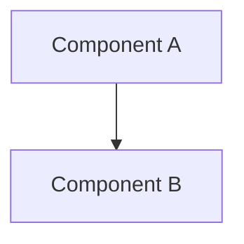
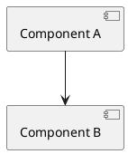
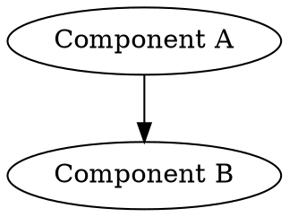

# Architecture Diagram

**Arguments:** $ARGUMENTS

## Instructions

Generate an architecture diagram based on the current conversation context and/or codebase.

### Argument Parsing

Parse the following from `$ARGUMENTS`:
- `[description]` — Optional free-text description of what to diagram. If omitted, diagram whatever was just discussed or the current project.
- `--type TYPE` — Diagram type. Default: `component`. The type is free-form; interpret it as the user intends. Common types include: component, sequence, class, deployment, flowchart, er, state, c4, data-flow, network, dependency.
- `--format FORMAT` — Output format. Default: `ascii`. Options: ascii, mermaid, plantuml, d2, dot, or any other format the user requests.
- `--deep-review` — When present, perform a holistic architecture review before diagramming. Read key source files, trace boundaries, identify coupling, then produce the diagram with annotations.
- `--output FILE` — File path to write the diagram to. Default: print inline.

### Workflow

**Standard mode (no --deep-review):**

1. Gather context from the current conversation — what was just discussed, any code shown, decisions made.
2. If a description is provided, use it to scope the diagram.
3. If no conversation context is sufficient, read key project files to understand structure:
   - `Cargo.toml` / `pyproject.toml` / `package.json` (dependencies and project shape)
   - Source directory structure via `ls`
   - Entry points (main.rs, lib.rs, index.ts, etc.)
4. Generate a diagram in the requested format.

**Deep review mode (--deep-review):**

1. Perform a systematic architecture review:
   - Read project manifest and dependency graph.
   - Enumerate modules/packages and their public APIs.
   - Trace key data flows and control flows.
   - Identify system boundaries (APIs, databases, external services).
   - Identify coupling points, shared state, and cross-cutting concerns.
   - Note architectural patterns in use (layered, hexagonal, event-driven, etc.).
2. Produce a brief architecture review summary (bullet points).
3. Generate a comprehensive diagram with:
   - All major components and their relationships.
   - Annotations for coupling hotspots or concerns.
   - External system boundaries clearly marked.

### Diagram Output by Format

**ASCII (default):**

Output a box-and-arrow diagram using Unicode box-drawing characters inside a fenced code block:

```
┌──────────────┐     ┌──────────────┐
│  Component A │────>│  Component B │
└──────────────┘     └──────┬───────┘
                            │
                            v
                     ┌──────────────┐
                     │  Component C │
                     └──────────────┘
```

Use `─`, `│`, `┌`, `┐`, `└`, `┘`, `├`, `┤`, `┬`, `┴`, `┼` for structure.
Use `─>`, `──>`, `<──`, `<─>` for directed edges.
Use `···>` or `- ->` for async/optional flows.
Group related components with larger bounding boxes when helpful.
Label edges on the line where possible.

**Mermaid (`--format mermaid`):**

````

````

**PlantUML (`--format plantuml`):**

````

````

**D2 (`--format d2`):**

````
```d2
Component A -> Component B
```
````

**DOT/Graphviz (`--format dot`):**

````

````

If the user requests a format not listed, interpret it and produce the closest reasonable output.

If `--output FILE` is specified, write the diagram source to that file and confirm the path.

### Type Interpretation Guide

The `--type` is free-form. Use your best judgment. Some mappings:

| User says | Diagram style |
|-----------|--------------|
| component | Boxes and arrows showing system components |
| sequence | Interactions between actors/components over time |
| class | Types, structs, traits and their relationships |
| deployment | Infrastructure nodes, services, networks |
| flowchart | Decision/process flow |
| er | Entity relationships (tables, fields, relations) |
| state | State machine transitions |
| c4 | C4 model (context, container, component) |
| data-flow | Data pipeline / transformation focus |
| dependency | Module/crate/package dependency DAG |

If the user provides a type not listed, interpret it creatively.

### Guidelines

- Prefer clarity over exhaustiveness. A readable diagram beats a complete one.
- Group related components visually where it aids understanding.
- Use meaningful labels, not file paths (e.g., "gRPC API" not "src/api/grpc.rs").
- For deep review, the written summary should be concise (10-20 bullet points max).
- Distinguish data flow from control flow when both are present (e.g., solid vs dashed lines in ASCII).
- If the system is too large for one diagram, state that and offer to break it into focused sub-diagrams.
- For ASCII diagrams, aim for max ~120 characters wide so they display well in terminals.
