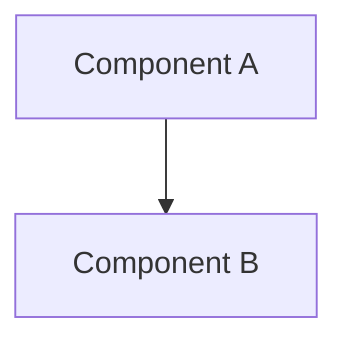
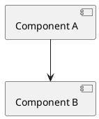
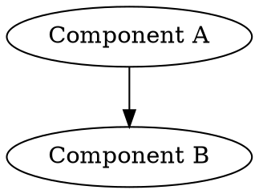

# Architecture Diagram

Generate an architecture diagram based on the current conversation context and/or codebase.

## Workflow

### 1. Parse Arguments

Extract:
- `[description]` — Optional free-text scope for the diagram. If omitted, diagram whatever was just discussed or the current project.
- `--type TYPE` — Diagram type (default: component). Free-form; interpret as the user intends. Common values: component, sequence, class, deployment, flowchart, er, state, c4, data-flow, dependency.
- `--format FORMAT` — Output format (default: ascii). Options: ascii, mermaid, plantuml, d2, dot, or any other format the user requests.
- `--deep-review` — Perform a holistic architecture review before diagramming.
- `--output FILE` — File path to write the diagram source to.

### 2. Gather Context

**Standard mode (no --deep-review):**

1. Use the current conversation context — what was just discussed, code shown, decisions made.
2. If a description is provided, use it to scope the diagram.
3. If conversation context is insufficient, read key project files:
   - Project manifest (`Cargo.toml`, `pyproject.toml`, `package.json`).
   - Source directory structure.
   - Entry points (`main.rs`, `lib.rs`, `index.ts`, etc.).

**Deep review mode (--deep-review):**

1. Perform a systematic architecture review:
   - Read project manifest and dependency graph.
   - Enumerate modules/packages and their public APIs.
   - Trace key data flows and control flows.
   - Identify system boundaries (APIs, databases, external services).
   - Identify coupling points, shared state, and cross-cutting concerns.
   - Note architectural patterns in use (layered, hexagonal, event-driven, etc.).
2. Produce a brief architecture review summary (10-20 bullet points).
3. Generate a comprehensive diagram with annotations for coupling hotspots.

### 3. Generate Diagram

**ASCII (default — `--format ascii` or no --format):**

Output a box-and-arrow diagram using Unicode box-drawing characters in a fenced code block:

```
┌──────────────┐     ┌──────────────┐
│  Component A │────>│  Component B │
└──────────────┘     └──────┬───────┘
                            │
                            v
                     ┌──────────────┐
                     │  Component C │
                     └──────────────┘
```

Use `─`, `│`, `┌`, `┐`, `└`, `┘`, `├`, `┤`, `┬`, `┴`, `┼` for structure.
Use `──>`, `<──`, `<─>` for directed edges. Use `···>` or `- ->` for async/optional.
Group related components with bounding boxes. Label edges inline.
Aim for max ~120 characters wide for terminal display.

**Mermaid (`--format mermaid`):**

````

````

**PlantUML (`--format plantuml`):**

````

````

**D2 (`--format d2`):**

````
```d2
Component A -> Component B
```
````

**DOT/Graphviz (`--format dot`):**

````

````

If the user requests a format not listed, interpret and produce the closest reasonable output.

If `--output FILE` is specified, write the diagram source to that file and confirm.

## Type Interpretation

The `--type` is free-form. Use best judgment:

| User says | Diagram style |
|-----------|--------------|
| component | Boxes and arrows showing system components |
| sequence | Interactions between actors/components over time |
| class | Types, structs, traits and their relationships |
| deployment | Infrastructure nodes, services, networks |
| flowchart | Decision/process flow |
| er | Entity relationships (tables, fields, relations) |
| state | State machine transitions |
| c4 | C4 model (context, container, component) |
| data-flow | Data pipeline / transformation focus |
| dependency | Module/crate/package dependency DAG |

## Examples

```bash
# Default: ASCII component diagram of what was just discussed
/archdiagram

# ASCII sequence diagram of the auth flow
/archdiagram auth flow --type sequence

# Mermaid class diagram
/archdiagram data model --type class --format mermaid

# Deep review, ASCII output
/archdiagram --deep-review

# Deep review as Mermaid, written to file
/archdiagram --deep-review --format mermaid --output docs/architecture.mmd

# PlantUML deployment diagram
/archdiagram production setup --type deployment --format plantuml
```

## Guardrails

- Prefer clarity over exhaustiveness. A readable diagram beats a complete one.
- Group related components visually where it aids understanding.
- Use meaningful labels, not file paths (e.g., "gRPC API" not "src/api/grpc.rs").
- For deep review, the written summary should be concise (10-20 bullet points max).
- Distinguish data flow from control flow when both are present (solid vs dashed lines).
- If the system is too large for one diagram, state that and offer to break it into focused sub-diagrams.
- Do not fabricate components that do not exist in the codebase or discussion.
