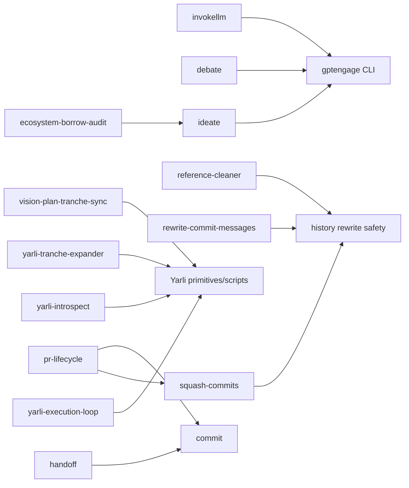

# Skill aggregation and elimination assessment

Date: 2026-07-11

Scope: the resolved 46-skill catalog, with focused assessment of the requested
overlap clusters. This is a read-first assessment. It does not install or remove
skills, configure an MCP, change a deployed copy, submit an issue, push, restart
anything, or delete the retained rollback backup.

## Decision summary

Do not replace `invokellm`, `debate`, and `ideate` with a GPTEngage MCP. In the
observed Codex runtime MCP tool descriptions and schemas are eagerly available
to the model, so a configured GPTEngage MCP would add default context for every
session. It would also need to reproduce the CLI's sensitive boundary contract:
outbound prompt/context data, per-backend selection, external-call cost,
timeouts, durable local sessions, write access, and structured failure classes.

Keep the three names as concise intent routers. Move duplicated GPTEngage policy
and per-operation option detail into a shared reference with operation-specific
sections. This retains discovery for “debate”, “brainstorm”, and “consult another
model”, retains slash-name compatibility, and reduces the maintained direct
prompt material for the three wrappers by an estimated 50 percent. Keep
`ecosystem-borrow-audit` as a distinct evidence-first audit; make its multi-sigma
ideation sweep explicitly optional rather than an automatic side effect.

The same general result holds for most other clusters: the names describe
meaningfully different outcomes or effect boundaries, while their repeated
execution policy should live in small shared references or scripts. The one
direct merge remains system-owned: fold `figma-implement-design` into a concise
`figma` router with an implementation recipe.

## Current inventory and backend graph

`scripts/audit_catalog.py` reports 46 resolved definitions, 46 unique names,
no collisions, and one oversized system-owned `skill-creator` prompt (417
lines). The repository source and deployed `~/.agents/skills` copies are byte
identical for all four GPTEngage-facing skills.

| Cluster | Current user-facing surfaces | Backend/shared implementation | Finding |
|---|---|---|---|
| GPTEngage | `invokellm`, `debate`, `ideate`, `ecosystem-borrow-audit` | `gptengage` Rust CLI; shared invocation reference | Three direct intents are distinct; execution policy is duplicated. |
| History surgery | `reference-cleaner`, `rewrite-commit-messages`, `squash-commits` | Git, `git filter-repo`, interactive rebase; `history-rewrite-safety.md` | Different transformations and recovery paths; share safety, do not merge names. |
| Yarli/planning | objective DAG, todos, vision sync, tranche expansion, inspect, execution loop | Pure planning plus `yarli`, five loop scripts, `yarli-primitives.md` | Planning layers and read/write boundaries are distinct; extract more shared operational policy. |
| Conversation analysis | live checker, retrospective analyzer | Python scripts and shared rules taxonomy | Temporal scope is a real distinction. |
| Memory diagnostics | system audit, per-process investigator | `/proc`, `ps`, optional approved attach/tracing | System pressure and longitudinal PID diagnosis are different evidence problems. |
| Creation/installation | `skill-creator`, `plugin-creator`, `skill-installer` | local validators/scaffolding; external Git/package acquisition for install | Different artifacts and approval domains; no merge. |
| Lifecycle | status, commit, handoff, PR lifecycle | Git; `gh` for PRs; `handoff` composes `commit` | Effect escalation is deliberate; share lifecycle vocabulary only. |
| Design | architecture diagram, raster image generation, Figma context, Figma implementation | local/code-native output, `image_gen` MCP, Figma MCP | Only the two Figma skills duplicate a workflow. |

## Evidence of actual use and maintenance

The local evidence is useful but insufficient to score invocation success or
value. It must not be presented as usage telemetry.

| Signal | Evidence | Interpretation and limit |
|---|---|---|
| GPTEngage availability | `gptengage status` reports Claude, Codex, Gemini, and an Ollama plugin available. | The backend is usable in this shell; it says nothing about wrapper preference. |
| GPTEngage persisted sessions | 15 files under `~/.gptengage/sessions`; newest modification is 2026-01-24. | Sessions are a real local persistence effect, but there is no recent invocation evidence. |
| Catalog maintenance | GPTEngage skills were introduced in March and changed in the July remediation commit. | They have recurring maintenance, not measured user demand. |
| Source instrumentation | GPTEngage stores session JSON but exposes no invocation counter, outcome class, token/cost total, or wrapper source. | No empirical basis exists to eliminate a wrapper on usefulness grounds. |
| Transcript evidence | Not scanned. | Avoided an unbounded/private transcript search; no conclusion about trigger frequency is warranted. |

The GPTEngage source also has pre-existing untracked files in its own repository:
`ideation-agent-social-timeline.txt` and
`research-agent-social-timeline-blockchain.txt`. This assessment did not modify
that repository.

## Context measurement method

Character counts are raw UTF-8 prompt text. Token counts use the locally
available `tiktoken` `cl100k_base` encoder, so they are comparable planning
estimates, not a claim about a particular runtime's billing tokenizer. Counts
are for source `SKILL.md` files and include frontmatter. Shared references are
measured separately because the skill contract requires them only after the
corresponding skill is selected.

| Cluster | Skill chars | Estimated tokens | Shared reference |
|---|---:|---:|---:|
| GPTEngage (four skills) | 14,848 | 3,945 | `gptengage-invocation.md`: 656 chars / 122 tokens |
| History surgery | 24,810 | 5,941 | history safety: 1,024 / 213 |
| Yarli and planning | 38,545 | 8,714 | Yarli primitives: 902 / 208 |
| Conversation analysis | 9,145 | 2,019 | shared rules are executable JSON, not a prompt reference |
| Memory diagnostics | 9,017 | 2,205 | none |
| Lifecycle | 29,472 | 7,034 | no common lifecycle reference yet |
| Architecture diagram | 5,445 | 1,304 | none |

For GPTEngage specifically, the current default skill-catalog descriptions are
878 characters / 209 estimated tokens across all four surfaces. This matters:
the normal skill model exposes descriptions for routing and loads an individual
skill body only when selected. Removing three wrappers therefore does *not*
save their 2,952 direct-wrapper tokens in every session; it chiefly changes
selected-skill cost, maintenance, and routing quality.

## MCP context evidence and GPTEngage alternatives

This session received callable descriptions and schemas for every configured
MCP tool before using any one of them. Measured description-plus-schema payloads
in the active runtime were:

| MCP namespace | Tools | Description/schema characters | Estimated tokens |
|---|---:|---:|---:|
| Haake | 26 | 29,773 | 7,445 |
| Selfimprove | 27 | 18,811 | 4,704 |
| GPTQueue | 7 | 6,114 | 1,529 |
| Cultivar | 6 | 4,947 | 1,238 |

This is direct evidence of eager exposure in this Codex integration. It does
not establish that every MCP client behaves identically, but there is no local
evidence for lazy tool discovery. A new GPTEngage MCP should therefore be
treated as default-session context until demonstrated otherwise in an isolated
capture.

| Option | Default routing context | Selected-operation context | Maintenance/discovery assessment | Recommendation |
|---|---|---|---|---|
| Current three direct skills | 141 estimated tokens of the three descriptions | invoke 1,321; debate 1,056; ideate 941, including the 122-token common reference | Good intent routing; option tables/examples and timeout policy repeat. | Replace implementation, not intent. |
| Three concise intent routers + operation recipes | about 85 tokens after description trim | modeled 500–650, common policy plus chosen recipe | Keeps exact names and natural-language triggers; one policy source. | **Target.** |
| One `gptengage` router skill | about 80–110 tokens | modeled 600–700 | Lowest source count, but risks losing exact `/debate`, `/ideate`, and `/invokellm` routing where aliases are unsupported. | Do not use without demonstrated alias compatibility. |
| One MCP tool with an operation enum | modeled 600–950 eager tokens | tool call has no skill body, but the union schema is always present | One schema must encode operation-specific validation, safety, effects, output, and error variants. | Reject for now. |
| Three narrow MCP tools | modeled 900–1,350 eager tokens | tool call has focused schema | Clearer validation, but all three schemas/policies remain eager. | Reject for now. |

The two MCP estimates are modeled lower bounds, not measurements of a
nonexistent GPTEngage MCP. They include only the minimum fields required to
avoid a policy regression: operation/backend/model, prompt or topic, context
and attachment paths, timeout, session, output format, write permission,
external-call disclosure, and a typed result/error envelope. A production
service would likely be larger.

### GPTEngage contract that must survive any consolidation

- Prompts, context files, stdin, and images are outbound data. Secret and
  private-source screening remains required before the call.
- `invoke` can select a named backend, defaults to a three-backend consultation
  in the wrapper, permits a model and persistent session, and defaults to 600
  seconds in the wrapper while the CLI defaults to 120 seconds.
- A session stores full conversation turns under `~/.gptengage/sessions`; that
  persistence must be disclosed, named deliberately, and never enabled by a
  generic consultation unless requested.
- `debate` has participant/round count and optional synthesis. Call count and
  cost scale with those choices; synthesis is an additional external call.
- `ideate` expands a ternary tree. Depth costs grow as `3^depth`; the CLI
  allows depth 1–5 and requires `--force` above 5.
- `--write` changes child CLI access from read-only to workspace-write/auto-edit
  behavior. It needs explicit intent and does not authorize remote actions.
- The CLI currently returns text or command-specific JSON and collapses
  subprocess failures into `anyhow` strings. A future MCP must add stable error
  codes for unavailable backend, authentication, timeout, refusal, malformed
  output, and write denial before it can replace the reference contract.

## Cluster dispositions

| Cluster | Surface disposition | Why separate skills remain justified | Consolidation work and estimated saving |
|---|---|---|---|
| GPTEngage | Keep three concise routers; shared reference; keep ecosystem audit, but make its ideation opt-in. | Consult, structured deliberation, divergent generation, and cross-repo evidence audit produce different outputs and costs. | Trim the first three from 2,952 to about 1,500 maintained tokens including recipes (about 49%). Trim ecosystem by about 350–450 tokens by calling the ideation recipe rather than embedding a loop. |
| History surgery | Keep all three; expand shared safety reference and put command recipes beside it. | Source/name scrub, message-only rewrite, and topology-preserving squash have different scope, tests, and rollback. | About 2,800–3,000 tokens (47–50%) is recoverable by moving repeated preflight, backup, approval, and recovery detail out of the 5,941-token bodies. No behavior merge. |
| Yarli/planning | Keep all six; retain explicit read-only `next-todos` and introspection boundary. | DAG reasoning, short planning, artifact sync, breadth research, diagnosis, and long-running supervision differ in mutation and duration. | About 2,500–3,100 tokens (29–36%) by moving common inspect/enqueue/relaunch policy to `yarli-primitives.md` and scripts. Do not combine inspect with execution loop. |
| Conversation analysis | Keep both; shared reference for transcript discovery, privacy, and rule taxonomy. | One is live correction; the other is completed-session reporting and artifact creation. | About 500–700 tokens (25–35%) without collapsing time scope. |
| Memory diagnostics | Keep both; add a small Linux evidence/safety reference only if it removes actual duplication. | Whole-host pressure and a stable target PID require different data and conclusions. | Modest, about 300–450 tokens (14–20%); not a count-reduction priority. |
| Creation/installation | Keep separate. | Skill authoring, plugin scaffold/marketplace work, and external acquisition/home installation have different owners and approvals. | No local merge. System `skill-creator` is the lone oversized prompt and is upstream-owned. |
| Lifecycle | Keep all four; compose rather than restate. | Status is read-only; commit mutates local history; handoff adds durable communication; PR adds remote writes. | About 2,000–2,300 tokens (28–33%) by extracting a common preflight/result vocabulary and letting `handoff`/PR lifecycle invoke authoritative subskills. |
| Design | Keep `archdiagram` and `imagegen` separate; merge Figma implementation into Figma router upstream. | Code-native diagrams, raster assets, and Figma-to-code use different backends and output media. | Figma source prompts can shrink from 3,405 to roughly 1,600–1,800 tokens (47–53%). The 5,278-token system `imagegen` prompt is a separate upstream context issue. |

These are attainable-source estimates, not a claim that all saved text currently
loads in one request. Validate the new sizes with `audit_catalog.py`, a fresh
ephemeral skill-resolution process, and one successful example for each retained
intent before changing deployment.

## Recommended target architecture

1. Retain the visible intent names: `invokellm`, `debate`, and `ideate`.
2. Make each manifest a short selector: intent, output, effect/cost warning,
   and the one command family it may use. Do not repeat option tables or shell
   loops.
3. Replace `gptengage-invocation.md` with a compact common contract plus links
   to `gptengage-invoke.md`, `gptengage-debate.md`, and `gptengage-ideate.md`.
   Read only the selected operation recipe.
4. Keep a small, explicit backend invocation helper or argument-vector recipe
   in the GPTEngage repository if command construction needs enforcement. The
   skill must not interpolate model input into executable source.
5. Change `ecosystem-borrow-audit` to produce its repository-grounded report by
   default, then offer or perform a multi-sigma ideation sweep only when the
   user explicitly requested it. Its current automatic four-sigma sweep is
   four expensive external exploration trees, not mere report formatting.
6. Apply the same pattern to history, Yarli, and lifecycle: compact intent
   manifests, one authoritative shared safety/primitive contract, and scripts
   for repeatable mechanics. Do not make a broad mega-router for unrelated
   effect classes.

## Migration, compatibility, and rollback

### Local Rahulskills work, after approval

1. Capture the current source and installed hashes with
   `scripts/mcp_contract_capture.py` and the existing deployment harness.
2. Add operation recipes and shorten the three GPTEngage manifests without
   renaming their directories or frontmatter names.
3. Update `ecosystem-borrow-audit` only after approval for the user-visible
   default change from automatic to explicit ideation.
4. Run catalog validation, stale-reference checks, targeted text tests, and a
   fresh read-only process that selects each legacy trigger. Verify a no-write
   CLI invocation only if the user authorizes its outbound call.
5. Deploy through the reviewed installer only with a fresh explicit installation
   approval. Retain the existing hash-verified backup at
   `$HOME/.local/state/rahulskills/backups/20260711T185810Z-39523bd` until the
   changed package is independently verified.

The compatibility window is simple: retain all existing names and their
argument hints, and make them route to the new references. There is no need to
remove a manifest in this phase. Roll back by reinstalling the retained pinned
backup after hash verification; do not use a source checkout or a branch name
as a rollback identity.

### Upstream-owned work

| Owner | Required change |
|---|---|
| GPTEngage | If an MCP is reconsidered, first add structured result/error types, explicit outbound-data and write semantics, cost/call estimates, and tests demonstrating lazy discovery in the target client. No MCP configuration now. |
| Codex/system skill owners | Merge Figma implementation workflow into the Figma skill; reduce the oversized system `skill-creator` and `imagegen` prompts. Do not locally overwrite system skills. |
| Rahulskills | Compact routers/references, history/Yarli/lifecycle extraction, catalog metadata, and tests. |

## Approval boundaries

| Action | Approval required? | Reason |
|---|---|---|
| This audit document and source-only measurements | No further approval | Local reporting/read-only inspection. |
| Changing a skill's automatic GPTEngage ideation behavior | Yes | Changes user-visible external-call cost and behavior. |
| Running GPTEngage for smoke verification | Yes | Sends prompt/context to external model backends. |
| Installing or removing skills, or touching the rollback backup | Yes | Changes user home deployment or recovery state. |
| Adding/configuring/restarting an MCP | Yes | Activates a new runtime capability and changes default context. |
| Removing legacy skill names | Yes | Breaks trigger/slash compatibility. |
| Pushing branches or submitting upstream issues | Yes | Shared remote-state changes. |

## Reproducibility notes

The evidence came from the checked-in skill/reference files, `gptengage --help`
and per-command help, local GPTEngage source at
`$HOME/Documents/gptengage`, bounded session-file metadata, catalog audit
output, and the runtime's exposed MCP descriptions. The requested Haake CLI
query could not run because the CLI has no local config; the configured Haake
MCP `query_memories` returned the durable handoff and related remediation
memories instead. No transcript corpus was searched.
