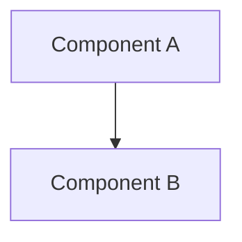
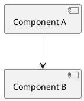
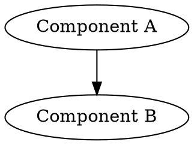

# Architecture Diagram

Generate an architecture diagram based on the current conversation context and/or codebase. The
selected `--format` controls the returned diagram representation; browser review
packaging is a separate operation handled by `diagram-review-viewer` when requested.

## Workflow

### 1. Parse Arguments

Extract:
- `[description]` — Optional free-text scope for the diagram. If omitted, diagram whatever was just discussed or the current project.
- `--type TYPE` — Diagram type (default: component). Free-form; interpret as the user intends. Common values: component, sequence, class, deployment, flowchart, er, state, c4, data-flow, dependency.
- `--format FORMAT` — Output format (default: ascii). Options: ascii, mermaid, plantuml, d2, dot, or any other format the user requests.
- `--deep-review` — Perform a holistic architecture review before diagramming.
- `--output FILE` — File path to write the diagram source to.

### 2. Gather Context

**Standard mode (no --deep-review):**

1. Use the current conversation context — what was just discussed, code shown, decisions made.
2. If a description is provided, use it to scope the diagram.
3. If conversation context is insufficient, read key project files:
   - Project manifest (`Cargo.toml`, `pyproject.toml`, `package.json`).
   - Source directory structure.
   - Entry points (`main.rs`, `lib.rs`, `index.ts`, etc.).

**Deep review mode (--deep-review):**

1. Perform a systematic architecture review:
   - Read project manifest and dependency graph.
   - Enumerate modules/packages and their public APIs.
   - Trace key data flows and control flows.
   - Identify system boundaries (APIs, databases, external services).
   - Identify coupling points, shared state, and cross-cutting concerns.
   - Note architectural patterns in use (layered, hexagonal, event-driven, etc.).
2. Produce a brief architecture review summary (10-20 bullet points).
3. Generate a comprehensive diagram with annotations for coupling hotspots.

### 3. Generate Diagram

**ASCII (default — `--format ascii` or no --format):**

Output a box-and-arrow diagram using Unicode box-drawing characters in a fenced code block:

```
┌──────────────┐     ┌──────────────┐
│  Component A │────>│  Component B │
└──────────────┘     └──────┬───────┘
                            │
                            v
                     ┌──────────────┐
                     │  Component C │
                     └──────────────┘
```

Use `─`, `│`, `┌`, `┐`, `└`, `┘`, `├`, `┤`, `┬`, `┴`, `┼` for structure.
Use `──>`, `<──`, `<─>` for directed edges. Use `···>` or `- ->` for async/optional.
Group related components with bounding boxes. Label edges inline.
Aim for max ~120 characters wide for terminal display.

**Mermaid (`--format mermaid`):**

````

````

### Review-oriented Mermaid protocol

For component, dependency, ecosystem, capability, or composition diagrams intended for architectural review, make the diagram explain both structure and judgment. Apply this protocol unless the user requests another visual system. Do not force these semantics onto sequence, class, ER, or state diagrams when they would not carry useful meaning.

- Use a white canvas and white component boxes. Keep group or subgraph backgrounds white or nearly white.
- Encode importance with border weight: major or orchestration components use a thick border; minor or specialized components use a thin border.
- Encode disposition with border color while keeping the box fill white:
  - Blue or neutral dark border: established component with no special disposition.
  - Green border: missing, proposed, or future component.
  - Orange border: existing component that needs improvement.
  - Red border: redundant, deprecated, or consolidation/removal candidate.
- Do not rely on color alone. Label proposed components and consolidation candidates explicitly, and include a legend whenever any disposition or importance styling is used.
- Use solid arrows for established, currently supported relationships. Use dashed arrows for proposed, weakly defined, indirect, or untyped relationships, and explain that convention in the legend.
- For non-obvious relationships, especially where the task asks about composition gaps, interpose a concise explanatory note between the connected boxes instead of relying on a terse edge label. Give note boxes a pale-yellow fill, black border, and black text. Each note should state what currently flows or composes across the relationship and what contract, artifact, authority, adapter, or verification is missing.
- Keep factual and evaluative claims distinct. Never render a proposed or inferred component as existing; mark it as missing or future. Treat redundancy and improvement classifications as review judgments, not repository facts.
- When detailed relationship notes make one canvas unreadable, preserve the overview and split dense areas into focused companion diagrams rather than shrinking text below practical reading size.

For example, a Mermaid component diagram may use class definitions equivalent to:

```
classDef major fill:#ffffff,stroke:#1d4ed8,stroke-width:4px,color:#000000,font-weight:bold;
classDef minor fill:#ffffff,stroke:#64748b,stroke-width:1.5px,color:#000000;
classDef missing fill:#ffffff,stroke:#16a34a,stroke-width:3px,color:#14532d,font-weight:bold;
classDef improve fill:#ffffff,stroke:#f97316,stroke-width:3px,color:#7c2d12;
classDef redundant fill:#ffffff,stroke:#dc2626,stroke-width:3px,color:#7f1d1d,font-weight:bold;
classDef relationship fill:#fef3c7,stroke:#111827,stroke-width:1.5px,color:#000000;
```

**PlantUML (`--format plantuml`):**

````

````

**D2 (`--format d2`):**

````
```d2
Component A -> Component B
```
````

**DOT/Graphviz (`--format dot`):**

````

````

If the user requests a format not listed, interpret and produce the closest reasonable output.
Do not silently switch to Mermaid or an HTML viewer because that format is
convenient. Preserve the user's selected format, and ask only when the choice
materially affects the deliverable.

If `--output FILE` is specified, write the selected diagram representation to
that file and confirm. Invoke `diagram-review-viewer` separately only when the
user asks for a browser-review package; that package retains the readable
Mermaid source and its digest.

## Type Interpretation

The `--type` is free-form. Use best judgment:

| User says | Diagram style |
|-----------|--------------|
| component | Boxes and arrows showing system components |
| sequence | Interactions between actors/components over time |
| class | Types, structs, traits and their relationships |
| deployment | Infrastructure nodes, services, networks |
| flowchart | Decision/process flow |
| er | Entity relationships (tables, fields, relations) |
| state | State machine transitions |
| c4 | C4 model (context, container, component) |
| data-flow | Data pipeline / transformation focus |
| dependency | Module/crate/package dependency DAG |

## Examples

```bash
# Default: ASCII component diagram of what was just discussed
/archdiagram

# ASCII sequence diagram of the auth flow
/archdiagram auth flow --type sequence

# Mermaid class diagram
/archdiagram data model --type class --format mermaid

# Deep review, ASCII output
/archdiagram --deep-review

# Deep review as Mermaid, written to file
/archdiagram --deep-review --format mermaid --output docs/architecture.mmd

# PlantUML deployment diagram
/archdiagram production setup --type deployment --format plantuml
```

## Guardrails

- Prefer clarity over exhaustiveness. A readable diagram beats a complete one.
- Group related components visually where it aids understanding.
- Use meaningful labels, not file paths (e.g., "gRPC API" not "src/api/grpc.rs").
- For deep review, the written summary should be concise (10-20 bullet points max).
- Distinguish data flow from control flow when both are present (solid vs dashed lines).
- For review-oriented Mermaid component diagrams, follow the visual and relationship-annotation protocol above.
- If the system is too large for one diagram, state that and offer to break it into focused sub-diagrams.
- Do not fabricate components that do not exist in the codebase or discussion.
