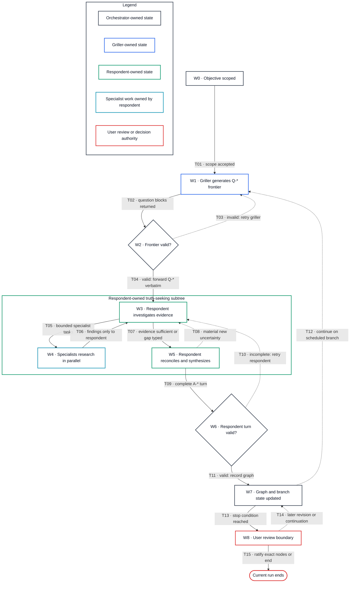
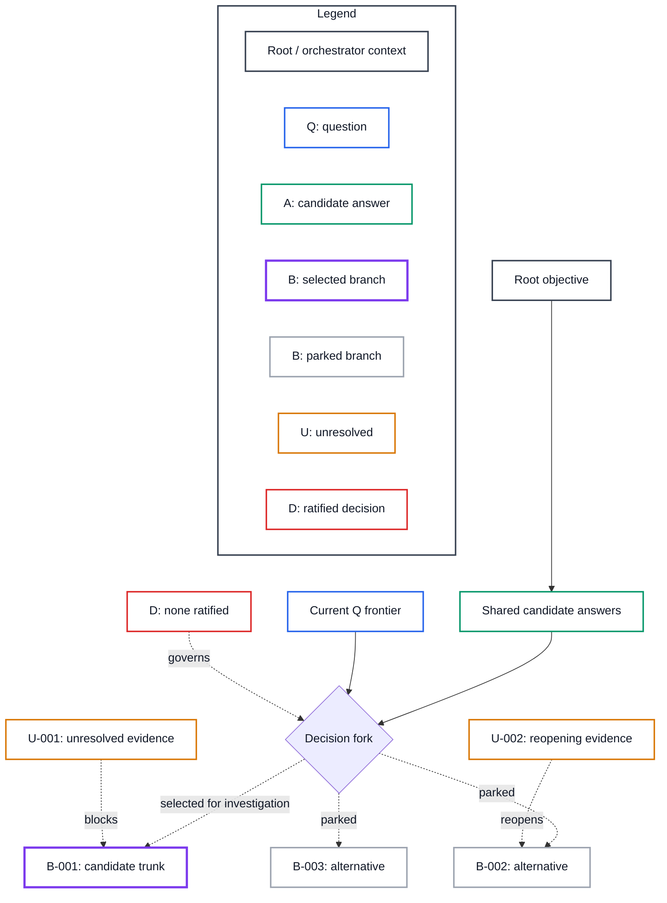

# Review-boundary presentation

Follow the gating rule in `../SKILL.md` (“At review boundaries”): this
reference is consulted only when the user explicitly requests the full graph
or protocol diagnostics. Within that opt-in, use this format when the review
has multiple dependency layers, branches, or unresolved uncertainties. Its
purpose is to let the user see what happened, what remains open, and what
input is expected without having to reverse-engineer the graph notation.

## Explain the node types first

Start with a compact legend:

| Node | Meaning | Does the user need to answer it now? |
| --- | --- | --- |
| `Q-*` | A question asked by the griller | Yes, when it is in the current frontier |
| `A-*` | A candidate answer from the respondent | Review for accuracy; it is not a decision |
| `B-*` | An alternative branch in the decision graph | Only if the review asks the user to schedule or ratify it |
| `U-*` | A fact, judgment, experiment, or dependency that remains unresolved | Only when `user-action-now: yes` |
| `D-*` | A decision explicitly ratified by the user | No; confirm the record is accurate |
| `R-*` | A bounded research task initiated by the respondent | No, unless its authorization exceeds scope |

State explicitly:

- The `A-*` graph records candidate answers and their dependencies. It is not a
  transcript and does not necessarily show the route the interview took.
- A `B-*` branch is not "taken" merely because the orchestrator selected it for
  the next investigation.
- The grilling happens in the `Q-* -> A-* -> follow-up Q-*` cycle. `A-*` nodes
  are the respondent's attempted answers to the grilling, not levels of grilling.
- The `U-*` ledger is a backlog of unresolved evidence. It is not a disguised
  list of homework for the user.

## Explain semantic flow versus mediated transport

In speculative mode, the semantic interview loop is:

```text
griller Q-* -> respondent A-* -> griller follow-up Q-* -> user review
```

The orchestrator validates the question-only contract and active frontier, then
forwards every valid `Q-*` block to the respondent verbatim. The respondent
exclusively owns its truth-seeking subtree: it dispatches `R-*` research to
specialists, receives their findings, reconciles conflicts, and returns a
synthesized `A-*` turn to the orchestrator. The orchestrator validates that
respondent turn and preserves the canonical graph.

Treat this as a hard topology invariant:

```text
orchestrator -> respondent -> specialist(s) -> respondent -> orchestrator
```

There is no orchestrator-to-specialist or specialist-to-orchestrator handoff.
The orchestrator may learn specialist provenance through the respondent's
synthesis, but it does not dispatch specialists, receive their raw turns,
request corrections from them, or synthesize their results. If the respondent
runtime lacks direct specialist delegation and specialist work is material,
show that capability gap as an unresolved limitation instead of using the
orchestrator as a fallback dispatcher.

In default interview mode, the griller's questions go to the user. In
speculative mode, they go to the respondent and reach the user only as part of
the review packet unless the user requested every raw turn.

Use this process sequence when the role topology itself needs review:

```mermaid
%%{init: {"theme":"base","themeVariables":{"actorBkg":"#ffffff","actorBorder":"#374151","actorTextColor":"#111827","signalColor":"#6b7280","signalTextColor":"#111827","noteBkgColor":"#ffffff","noteBorderColor":"#d97706"}}}%%
sequenceDiagram
    actor U as User
    participant O as Orchestrator
    participant G as Question-only griller
    participant R as Evidence-seeking respondent
    participant S as Respondent-owned specialists

    U->>O: Objective and authorization
    O->>G: Active graph and answer ancestry
    G->>O: Q-* frontier only
    O->>O: Validate question contract and frontier
    O->>R: Valid Q-* blocks verbatim
    R->>S: Bounded parallel research tasks
    S->>R: Evidence, counterevidence, uncertainty
    R->>R: Reconcile and synthesize
    R->>O: Complete A-* turn with provenance
    O->>O: Validate and update canonical graph
    alt Continue grilling
        O->>G: Synthesized A-* turn and graph ancestry
    else Review boundary
        O->>U: Review packet; no implied decisions
    end
```

Sequence legend:

- **Roles:** `O` owns protocol and graph state; `G` owns questions; `R` owns
  truth-seeking, specialist delegation, and synthesis; `S` reports only to
  `R`; `U` alone ratifies decisions.
- **Lines:** arrows are actual transport paths; self-arrows are internal
  validation or synthesis; `alt` marks mutually conditional continuations.
  The absence of an `O <-> S` arrow is intentional.
- **Identifiers:** `Q-*` is a griller question frontier and `A-*` is a
  respondent candidate-answer turn. `R-*` research remains inside the
  respondent-owned subtree until included in its synthesis.

Mermaid does not reliably support a different border class for each sequence
participant. Keep sequence participant bodies white with a neutral charcoal
border, then supply the role-colored flowchart immediately after it. Do not
claim that participant border color carries meaning in the sequence diagram.

Use this process flowchart when validation and retry behavior need to be made
explicit:



The flowchart deliberately contains no edge between the orchestrator and a
specialist. White bodies keep state neutral; border color carries role meaning.

Diagram legend:

- **Border colors:** charcoal = orchestrator; blue = griller; green =
  respondent; cyan = respondent-owned specialist work; red = user review or
  ratification authority. Every body is white; color never implies acceptance.
- **Line styles:** solid = the normal observed handoff when its guard passes;
  dashed = retry, conditional continuation, or a future transition after the
  current review boundary.
- **Identifiers:** `W-*` names a workflow state and `T-*` names a transition.
  These are process identifiers, not evidence or decision-graph nodes. `Q-*`,
  `A-*`, `B-*`, `U-*`, `D-*`, and `R-*` retain the artifact meanings defined
  above.

## Explain every workflow state

When showing the process model, follow the diagram with a state table. Do not
make the user infer state meaning from a short box label.

| State | Owner | What happens in the state | State ends when | Persisted output |
| --- | --- | --- | --- | --- |
| `W0` Objective scoped | Orchestrator | Captures the objective, evidence authorities, authorization, stop boundary, and active graph ancestry. | The inquiry is sufficiently bounded to ask questions. | Scope and authority envelope; no candidate answer or decision. |
| `W1` Question frontier generation | Griller | Produces dependency-aware `Q-*` blocks only. It does not answer, recommend, judge, or research. | A complete proposed frontier is returned. | Proposed `Q-*` blocks, pending validation. |
| `W2` Frontier validation | Orchestrator | Checks question-only form, authorization, duplication, dependency relevance, and active-branch fit. This is protocol validation, not substantive agreement. | The frontier either passes unchanged or is rejected for a griller retry. | Validation result. Invalid blocks never reach the respondent. |
| `W3` Evidence investigation | Respondent | Receives valid `Q-*` blocks verbatim, inventories dependencies, inspects local evidence, searches allowed sources, and decides whether bounded specialist work is material. | Evidence is sufficient, an evidence gap is typed, or specialist tasks are required. | Evidence inventory and provisional `A-*` reasoning inside the respondent turn. |
| `W4` Specialist research | Respondent-owned specialists | Executes bounded tasks in parallel under the respondent's context, evidence standard, and stop conditions. Specialists return evidence and counterevidence only to the respondent. | Every bounded task meets its stop condition, times out, or reports a limitation. | `R-*` findings held by the respondent; there is no direct orchestrator handoff. |
| `W5` Respondent synthesis | Respondent | Reconciles conflicts, preserves minority findings and uncertainty, updates dependent answers, and decides whether new research could materially reverse the answer. | One complete, candid `A-*` turn is ready, or the respondent returns to investigation. | Synthesized `A-*`, provenance, typed `U-*`, and optional `R-*` ledger. |
| `W6` Respondent-turn validation | Orchestrator | Checks completeness, schema, evidence boundaries, provenance visibility, and unauthorized decisions. It does not redo the research or contact specialists. | The turn passes or is returned to the respondent. | Validation result; no silent answer rewriting. |
| `W7` Graph and branch update | Orchestrator | Records `Q/A/B/U/R` nodes and edges, invalidates only dependent subtrees, and schedules the economically strongest investigation trunk without calling it a decision. | Another grilling cycle is useful or a stop condition has been reached. | Canonical candidate graph and branch ledger. |
| `W8` User review boundary | User, packaged by orchestrator | Presents what happened, what remains unresolved, what needs user action now, and what has not been executed or ratified. The current run stops here. | In a later turn, the user ratifies exact nodes, revises upstream intent, reschedules work, or ends the inquiry. | Only explicit user ratification creates `D-*`; deferral creates no decision. |

## Explain every transition

A transition label is an event plus its guard. For each transition shown in a
review, state what crosses the boundary and what is explicitly prohibited.

| Transition | From → To | Trigger and guard | Information that crosses the boundary | Prohibited behavior |
| --- | --- | --- | --- | --- |
| `T01` | `W0 → W1` | Scope and authorization are sufficient. | Objective, evidence authorities, active ancestry, and stop rule. | Treating scope as a ratified solution. |
| `T02` | `W1 → W2` | The griller returns a proposed frontier. | Complete question-only blocks and structural metadata. | Preamble, answers, verdicts, or recommendations from the griller. |
| `T03` | `W2 → W1` | Any question violates format, scope, or active dependencies. | A protocol correction to the griller. | Partially forwarding or silently repairing invalid blocks. |
| `T04` | `W2 → W3` | Every forwarded block passes validation. | The valid `Q-*` blocks verbatim; transport metadata travels separately. | Editing, summarizing, reordering, enriching, or answering the questions. |
| `T05` | `W3 → W4` | Independent specialist work can materially improve the answer and the respondent runtime supports direct delegation. | Bounded task, context, evidence standard, output contract, and stop condition. | Any orchestrator-to-specialist communication. |
| `T06` | `W4 → W3` | A specialist task completes or reports a limitation. | Evidence, counterevidence, uncertainty, sources, and completion status to the respondent only. | Specialist output going directly to the orchestrator or user. |
| `T07` | `W3 → W5` | Evidence is sufficient, or remaining gaps have explicit types and resolution paths. | Evidence inventory, candidate reasoning, provenance, and limitations. | Concealing a runtime or evidence limitation to appear complete. |
| `T08` | `W5 → W3` | Synthesis exposes a new uncertainty capable of materially reversing the answer. | The newly bounded research dependency. | Endless research for uncertainties that cannot change the active decision. |
| `T09` | `W5 → W6` | The respondent has one complete candidate-answer turn. | Synthesized `A-*`, revisions, provenance, typed `U-*`, and any respondent-produced `R-*` ledger. | Sending unreconciled specialist turns as orchestrator inputs. |
| `T10` | `W6 → W3` | The respondent turn is incomplete, malformed, or exceeds authority. | Original frontier, validation defect, and prior respondent checkpoints. | The orchestrator brokering partial specialist traffic or inventing missing content. |
| `T11` | `W6 → W7` | The respondent turn passes its contract. | Validated candidate answers and dependency metadata. | Converting an `A-*` answer into a `D-*` decision. |
| `T12` | `W7 → W1` | More grilling has positive information value and no stop rule applies. | Selected branch, relevant ancestry, and prior respondent answer. | Describing a scheduled branch as executed or ratified. |
| `T13` | `W7 → W8` | The requested review boundary or another stop condition is reached. | Review packet, ledgers, diagrams, current asks, and explicit non-actions. | Continuing autonomously beyond the boundary. |
| `T14` | `W8 → W7` | In a later turn, the user revises, defers, or requests continuation. | Exact user changes and the subtree they invalidate or reopen. | Inferring approval from silence or deferral. |
| `T15` | `W8 → end` | The user ratifies exact nodes or ends the inquiry. | Exact `D-*` records, if any, plus the stop record. | Ratifying unmentioned branches, thresholds, or implementation authority. |

## Show topology before detail

For three or more answer nodes with shared dependencies, or for two or more
branches, include a Mermaid `flowchart`. Flowcharts preserve dependency and
fork topology better than mindmaps, state diagrams, timelines, or architecture
diagrams for this use.

When the user may confuse the interview process with the decision topology,
add a small Mermaid `sequenceDiagram` before the flowchart. The sequence must
show the actual role loop—griller questions, respondent answers/research,
griller follow-up, and user review—without implying that `A-*` identifiers are
depth levels. Keep the flowchart as the authority for dependencies and branch
forks; the sequence diagram is only a process explanation.

Every diagram must have an adjacent legend covering three dimensions:

1. role or artifact meaning for every border color;
2. transition or dependency meaning for every line style; and
3. identifier meaning for every prefix visible in the diagram.

Put a legend subgraph inside a flowchart when it remains readable, and add a
compact Markdown legend immediately below whenever edge or identifier semantics
would otherwise remain implicit. A sequence diagram should normally use the
adjacent Markdown legend because Mermaid sequence diagrams do not support
per-participant classes consistently.

Use white node bodies with colored borders and dark text. Keep the palette
stable within one review packet:

- root or orchestrator: charcoal border (`#374151`);
- `Q-*` or griller: blue border (`#2563eb`);
- `A-*` or respondent: green border (`#059669`);
- `B-*` selected for investigation: violet border (`#7c3aed`);
- `B-*` parked: gray border (`#9ca3af`);
- `U-*`: amber border (`#d97706`);
- `D-*` or user-ratified decision: red border (`#dc2626`); and
- `R-*` research: cyan border (`#0891b2`).

Use neutral gray edges for transport and dependencies. Use dashed edges for
candidate scheduling, blocking, or reopening relationships; reserve solid
edges for observed transport or established dependencies. Do not use fill
color alone to convey meaning.

The diagram must:

- place each branch at its real `forks-from` node instead of implying every
  branch starts at the root;
- distinguish `selected-for-investigation`, `parked`, `executed`, and
  `ratified`;
- show the uncertainties that block or reopen each branch;
- omit low-value detail when every `Q-*` edge would make the graph unreadable;
  group the current question frontier in one node when needed; and
- label inferred or candidate edges differently from ratified edges.

Use this adaptable shape:



Dependency-diagram legend:

- **Borders:** charcoal = root/orchestrator context; blue = question; green =
  candidate answer; violet = selected-for-investigation branch; gray = parked
  branch; amber = unresolved evidence; red = user-ratified decision. All node
  bodies remain white.
- **Lines:** solid = established dependency; dashed = scheduling, blocking,
  reopening, or another candidate relationship. The edge label states which.
- **Identifiers:** `Q/A/B/U/D` have the artifact meanings in the node-type table
  above. Diagram position does not imply chronology, execution, or ratification.

Generate the graph from the actual nodes; do not copy the example's topology.
If Mermaid is unavailable, use an ASCII dependency tree with the same labels.

## Present answer nodes by layer

Call the section `Candidate answer graph`, not `Candidate chain`, unless every
node has exactly one forward successor and the result is genuinely linear.
Group nodes by topological layer:

1. root facts and claim boundaries;
2. shared product, technical, or economic premises;
3. fork criteria;
4. branch-specific implications; and
5. stop or reopening rules.

For each node show its dependencies and what would change it. Do not imply that
the orchestrator executed a branch merely because it appears later in the
display.

## Type every uncertainty

Each `U-*` entry must contain:

```text
U-004
kind: recoverable-fact | research-needed | experiment-needed | user-judgment | external-dependency
depends-on: <node IDs>
uncertainty: <what is not known>
resolver: <agent, user, experiment, counsel, customer, external event>
resolution-path: <specific method>
blocks-or-reopens: <node IDs>
user-action-now: yes | no
```

Do not ask the user to solve a `research-needed` or `experiment-needed`
uncertainty from intuition. Ask only for authority, preferences, thresholds, or
facts uniquely held by the user.

## Make branch status unambiguous

Each `B-*` entry must contain:

```text
B-002
forks-from: <A/Q/D node IDs>
status: selected-for-investigation | parked | executed | falsified | ratified
rationale: <orchestrator scheduling reason, not griller opinion>
evidence-gained: <none if not executed>
reopening-condition: <observable condition>
user-action-now: yes | no
```

Never use `selected-for-investigation` as a synonym for `executed` or
`ratified`. If the review stops before an experiment, say that the branch was
scheduled in the graph but not run.

## Separate review asks from supporting ledgers

Before showing the full ledgers, include `What I need from you now` with no more
than five concrete asks. Typical asks are:

1. correct a candidate answer that misstates the user's intent;
2. confirm or reject the proposed fork criterion;
3. select which branch should be investigated next;
4. ratify threshold variables or leave them explicitly unset; or
5. answer the current `Q-*` frontier where the answer is genuinely a user
   judgment.

For each ask, state what happens if the user agrees, disagrees, or defers. Do
not place research tasks, implementation tasks, or recoverable repository facts
in this list.

## Recommended review-packet order

1. `How to read this review`
2. `What I need from you now`
3. Mermaid workflow-state diagram, legend, and relevant `W/T` explanations
   when the process itself is under review
4. Mermaid dependency and branch diagram
5. `Candidate answer graph` by topological layer
6. `Branch ledger`
7. `Unresolved ledger`, typed by resolver
8. current `Q-*` frontier
9. `D-*` decisions actually ratified
10. downstream invalidation rules and explicit stop/continuation condition

At the stop boundary, state what has not happened: no branch was executed, no
threshold was ratified, and no implementation was authorized unless the record
shows otherwise.
